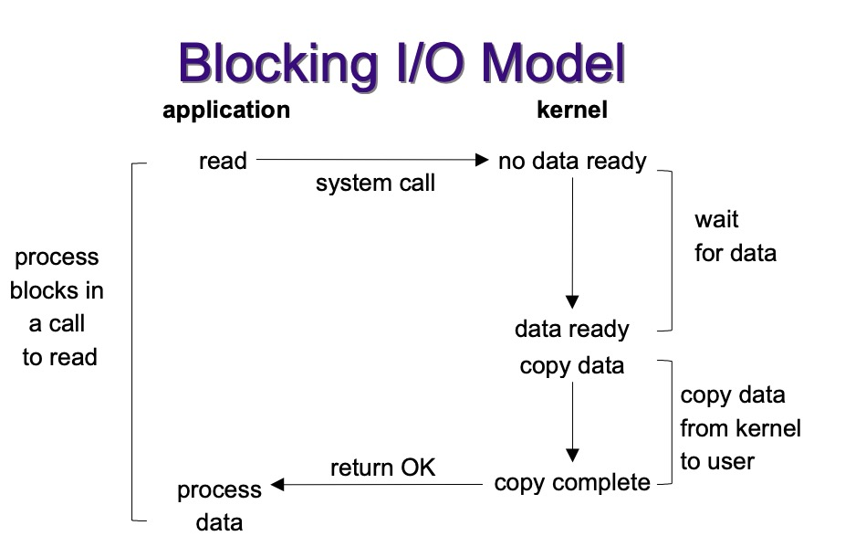
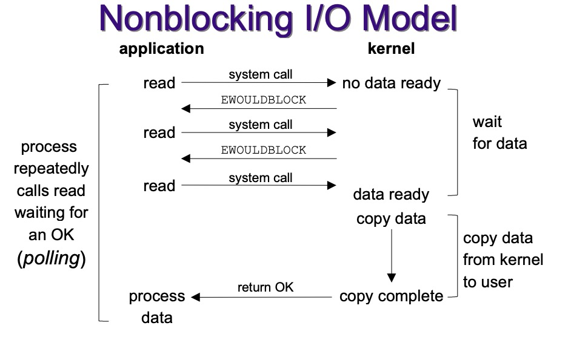
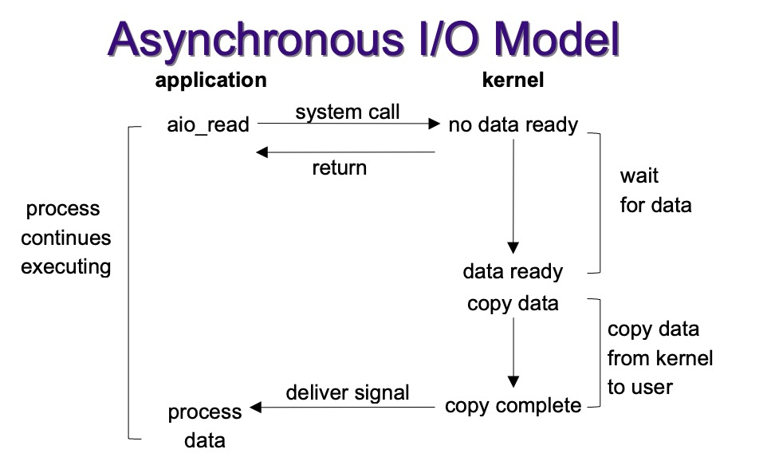
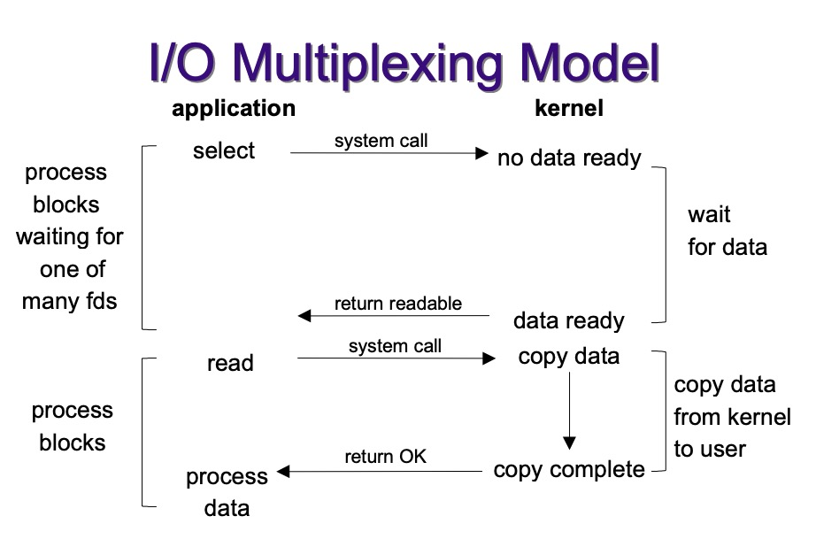

= io多路复用(multiplexing)
:doctype: book
:encoding: utf-8
:lang: zh-cn
:toc: left
:toc-title: 导航目录
:toclevels: 4
:sectnums:
:sectanchors:

:hardbreaks:
:experimental:
:icons: font

pass:[<link rel="stylesheet" href="https://cdnjs.cloudflare.com/ajax/libs/font-awesome/4.7.0/css/font-awesome.min.css">]

参考阅读-io::
https://journey-c.github.io/io-multiplexing/#25-io-multiplexing[]

我们以小明去食堂打饭为例,来类比不同的IO模型;

== Blocking-I/O

小明(application)去食堂窗口(kernel)打饭(read),一直等待直到这个窗口(kernel)的饭做好(data-ready);

== Nonblocking-I/O

小明(application)去食堂窗口(kernel)打饭(read),一遍玩手机(非阻塞),一遍不断询问(poll)窗口(kernel),然后等待饭做好(data-ready);

== Asynchronous-I/O

小明(application)去食堂窗口(kernel)打饭(read);窗口(kernel)给了小明一张票,等数据准备好了,再喊小明;

== io-multiplexing

