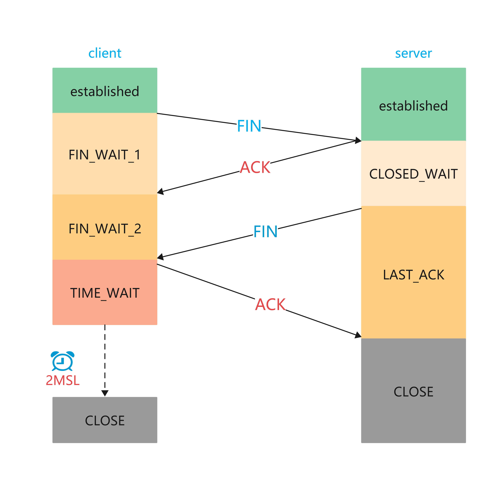

= tcp
:doctype: book
:encoding: utf-8
:lang: zh-cn
:toc: left
:toc-title: 导航目录
:toclevels: 4
:sectnums:
:sectanchors:

:hardbreaks:
:experimental:
:icons: font

pass:[<link rel="stylesheet" href="https://cdnjs.cloudflare.com/ajax/libs/font-awesome/4.7.0/css/font-awesome.min.css">]

推荐阅读-tcp::
https://mp.weixin.qq.com/s?__biz=MzUxODAzNDg4NQ==&mid=2247484005&idx=1&sn=cb07ee1c891a7bdd0af3859543190202&scene=21#wechat_redirect[小林coding-图解计算机网络-tcp]

参考阅读-tcp::
https://zhuanlan.zhihu.com/p/351414704[]

推荐阅读-tcp::
https://mp.weixin.qq.com/s?__biz=MzUxODAzNDg4NQ==&mid=2247484469&idx=1&sn=55ec7f4addf10ddf25e8c8806da83921&chksm=f98e409fcef9c9891b92945129e8e1c9ca79f95be4cf3a85cea13fa0b57bc63c19d53f0e5b4e&cur_album_id=1337204681134751744&scene=190#rd[小林coding-图解计算机网络-tcp-wireshark]

== TCP-报文格式
Transmission Control Protocol

使用 Wireshark 捕获到的tcp报文

[source]
----
Transmission Control Protocol, Src Port: 61732, Dst Port: 80, Seq: 0, Len: 0
    Source Port: 61732
    Destination Port: 80
    [Stream index: 324]
    [TCP Segment Len: 0]
    Sequence Number: 0    (relative sequence number)
    Sequence Number (raw): 714972547
    [Next Sequence Number: 1    (relative sequence number)]
    Acknowledgment Number: 0
    Acknowledgment number (raw): 0
    1000 .... = Header Length: 32 bytes (8)
    Flags: 0x002 (SYN)
    Window: 64240
    [Calculated window size: 64240]
    Checksum: 0x0f60 [unverified]
    [Checksum Status: Unverified]
    Urgent Pointer: 0
    Options: (12 bytes), Maximum segment size, No-Operation (NOP), Window scale, No-Operation (NOP), No-Operation (NOP), SACK permitted
    [Timestamps]
----

.报文格式

=== 报文参数说明

Sequence Number (raw)::
初始序列号,即isn(init-sequence-number);

Sequence Number::
序列号,由init-sequence-number作为其初始值，通过 SYN 包传给接收端主机，每发送一次数据，就「累加」一次该「数据字节数」的大小。#用来解决网络包乱序问题。#

Acknowledgment Number::
应答号,指下一次「期望」收到的数据的序列号，发送端收到这个确认应答以后可以认为在这个序号以前的数据都已经被正常接收。#用来解决不丢包的问题#

Window-size::
窗口大小,流量控制

check-sum::
校验和,数据可靠性

*Flags-控制位*

- URG
urgent,紧急标志

- ACK
Acknowledgement Number,应答标志

- PSH
Push,推送标志

- RST
Rest,复位标志,用来关闭异常的连接

- SYN
Synchronize Sequence Numbers(同步序列号),同步标志

- FIN
Final,终结标志

== UDP-报文格式
User Datagram Protocol

.udp-报文格式

== TCP-传输层协议

- 面向连接
一定是「一对一」才能连接，不能像 UDP 协议 可以一个主机同时向多个主机发送消息，也就是一对多是无法做到的；

- 可靠的
无论的网络链路中出现了怎样的链路变化，TCP 都可以保证一个报文一定能够到达接收端；

- 字节流
消息是「没有边界」的，所以无论我们消息有多大都可以进行传输。并且消息是「有序的」，当「前一个」消息没有收到的时候，即使它先收到了后面的字节已经收到，那么也不能扔给应用层去处理，同时对「重复」的报文会自动丢弃。

== TCP-总体流程

.tcp-连接-传输-关闭

== TCP-三次握手-建立连接

建立连接需要三次握手

.tcp-三次握手

- 第一次握手[server,我们可以通话吗?]
syn;
seq_num=client_isn=714972547;
ack_num=0;

[source]
----
Transmission Control Protocol, Src Port: 61732, Dst Port: 80, Seq: 0, Len: 0
    Source Port: 61732
    Destination Port: 80
    [Stream index: 324]
    [TCP Segment Len: 0]
    Sequence Number: 0    (relative sequence number)
    Sequence Number (raw): 714972547
    [Next Sequence Number: 1    (relative sequence number)]
    Acknowledgment Number: 0
    Acknowledgment number (raw): 0
    1000 .... = Header Length: 32 bytes (8)
    Flags: 0x002 (SYN)
    Window: 64240
    [Calculated window size: 64240]
    Checksum: 0x0f60 [unverified]
    [Checksum Status: Unverified]
    Urgent Pointer: 0
    Options: (12 bytes), Maximum segment size, No-Operation (NOP), Window scale, No-Operation (NOP), No-Operation (NOP), SACK permitted
    [Timestamps]
----

- 第二次握手[好的,client,我们可以通话]
syn,ack;
ack_num=client_isn+1=714972548;
seq_num=server_isn=25992591;
[source]
----
Transmission Control Protocol, Src Port: 80, Dst Port: 61732, Seq: 0, Ack: 1, Len: 0
    Source Port: 80
    Destination Port: 61732
    [Stream index: 324]
    [TCP Segment Len: 0]
    Sequence Number: 0    (relative sequence number)
    Sequence Number (raw): 25992591
    [Next Sequence Number: 1    (relative sequence number)]
    Acknowledgment Number: 1    (relative ack number)
    Acknowledgment number (raw): 714972548
    1000 .... = Header Length: 32 bytes (8)
    Flags: 0x012 (SYN, ACK)
    Window: 64240
    [Calculated window size: 64240]
    Checksum: 0x0cbf [unverified]
    [Checksum Status: Unverified]
    Urgent Pointer: 0
    Options: (12 bytes), Maximum segment size, No-Operation (NOP), No-Operation (NOP), SACK permitted, No-Operation (NOP), Window scale
    [SEQ/ACK analysis]
        [This is an ACK to the segment in frame: 23051]
        [The RTT to ACK the segment was: 0.002030000 seconds]
        [iRTT: 0.002092000 seconds]
    [Timestamps]
----

- 第三次握手[好的,server,我们通话吧!]
ack;
ack_num=server_isn+1=25992592;
seq_num=714972547+1=714972548;
仔细比较1,3次握手中seq_num;
[source]
----
Transmission Control Protocol, Src Port: 61732, Dst Port: 80, Seq: 1, Ack: 1, Len: 0
    Source Port: 61732
    Destination Port: 80
    [Stream index: 324]
    [TCP Segment Len: 0]
    Sequence Number: 1    (relative sequence number)
    Sequence Number (raw): 714972548
    [Next Sequence Number: 1    (relative sequence number)]
    Acknowledgment Number: 1    (relative ack number)
    Acknowledgment number (raw): 25992592
    0101 .... = Header Length: 20 bytes (5)
    Flags: 0x010 (ACK)
    Window: 512
    [Calculated window size: 131072]
    [Window size scaling factor: 256]
    Checksum: 0x0f54 [unverified]
    [Checksum Status: Unverified]
    Urgent Pointer: 0
    [SEQ/ACK analysis]
        [This is an ACK to the segment in frame: 23052]
        [The RTT to ACK the segment was: 0.000062000 seconds]
        [iRTT: 0.002092000 seconds]
    [Timestamps]
----

[TIP]
====
使用netstat 观察tcp连接状态
 netstat -anpt | head -2;netstat -anpt | grep tcp
====

=== 为什么需要三次握手

- 避免历史连接和资源浪费

[source]
----
client;新的连接
seq_num = 1500
ack_num = 0

client;旧的连接重发先达
seq_num = 1000
ack_num = 0

server响应旧的请求
ack_num = 1000 + 1
seq_num = server_isn

client;检测到server的ack_num != 1500 + 1
client;发起RST中止连接

两次握手,确实可以建立连接,但是若没有第三次的握手,客户端则无法检测到server端的异常连接
----

- 同步初始化序列号
server 和 client 互相需要知道对方的序列号;

不使用「两次握手」和「四次握手」的原因：

「两次握手」：无法防止历史连接的建立，会造成双方资源的浪费，也无法可靠的同步双方序列号；

「四次握手」：三次握手就已经理论上最少可靠连接建立，所以不需要使用更多的通信次数。

== ISN

起始 ISN 是基于时钟的，每 4 毫秒 + 1，转一圈要 4.55 个小时。

RFC1948 中提出了一个较好的初始化序列号 ISN 随机生成算法。

ISN = M + F (localhost, localport, remotehost, remoteport)

M 是一个计时器，这个计时器每隔 4 毫秒加 1。

F 是一个 Hash 算法，根据源 IP、目的 IP、源端口、目的端口生成一个随机数值。要保证 Hash 算法不能被外部轻易推算得出，用 MD5 算法是一个比较好的选择。

== 四次挥手-断开连接

四次挥手可能会如三次握手一般合并成三次挥手

== 基于socket的通信

