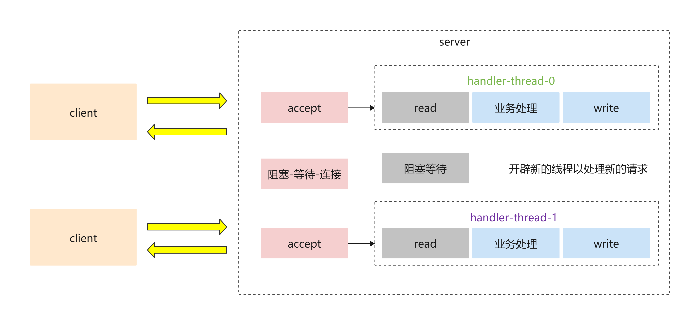
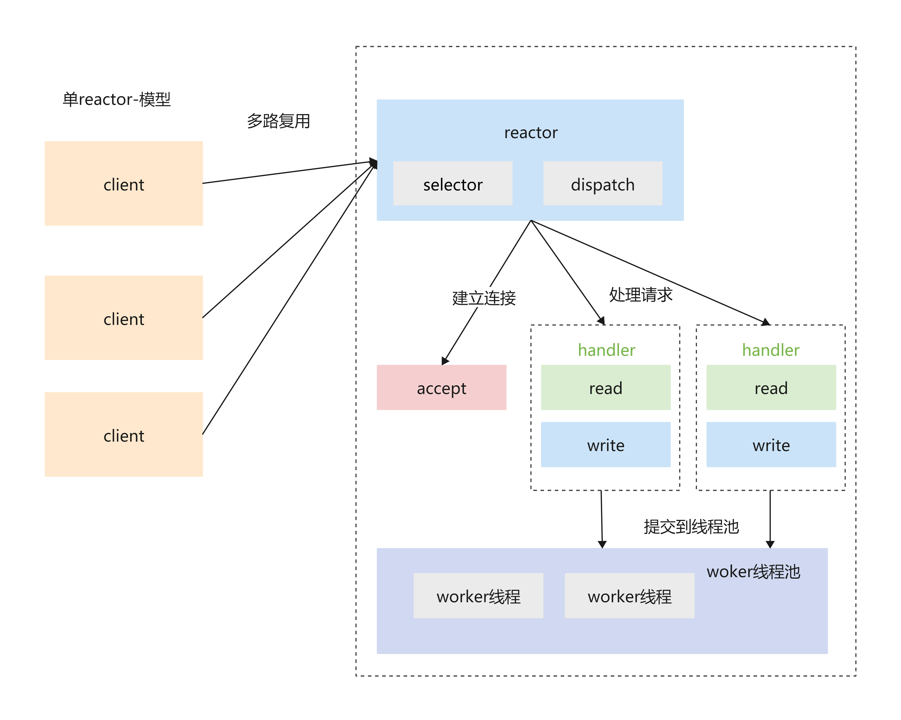
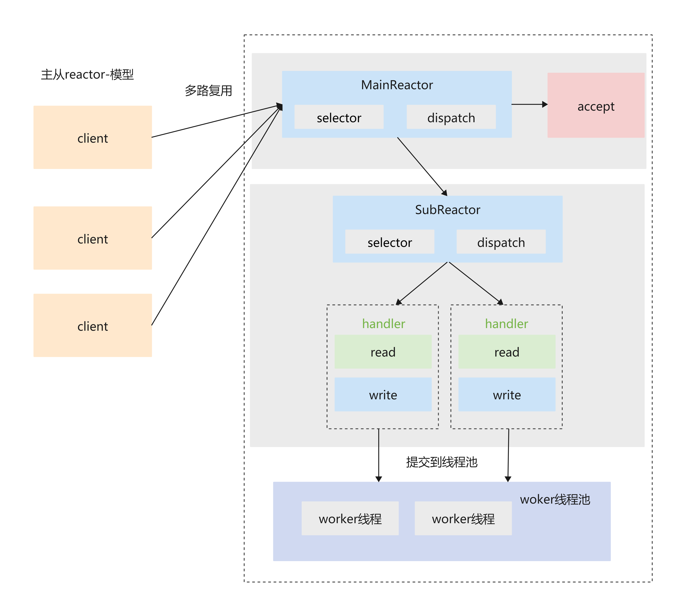
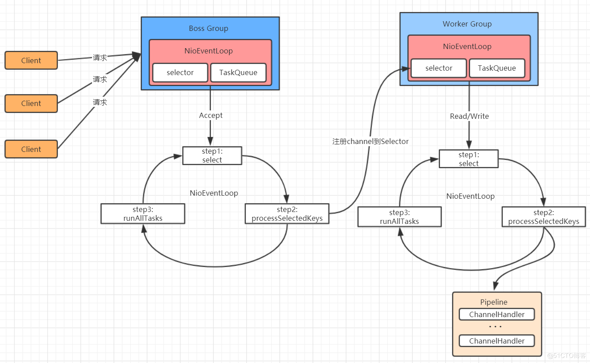

= netty的线程模型
:doctype: book
:encoding: utf-8
:lang: zh-cn
:toc: left
:toc-title: 导航目录
:toclevels: 4
:sectnums:
:sectanchors:

:hardbreaks:
:experimental:
:icons: font

pass:[<link rel="stylesheet" href="https://cdnjs.cloudflare.com/ajax/libs/font-awesome/4.7.0/css/font-awesome.min.css">]

== BIO线程模型

link:..\src\main\java\indi\netty\yufr\bio\SocketServer.java[代码描述-SocketServer.java,window=_blank]
link:..\src\main\java\indi\netty\yufr\bio\SocketClient.java[代码描述-SocketClient.java,window=_blank]

存在的问题

. 当并发数很大，就会创建大量的线程，占用很大系统资源
. 连接创建后，如果当前线程暂时没有数据可读，该线程会阻塞在 read 操作，造成线程资源浪费

== Reactor线程模型

Reactor 模式，通过一个或多个输入同时传递给服务处理器的模式,服务器端程序处理传入的多个请求,并将它们同步分派到相应的处理线程，因此 Reactor 模式也叫 Dispatcher模式. Reactor 模式使用IO 复用监听事件, 收到事件后，分发给某个线程(进程), 这点就是网络服务器高并发处理关键.

=== 单Reactor单线程

存在的问题

. 多线程数据共享和访问比较复杂，reactor处理所有的事件的监听和响应，在单线程运行，在高并发场景容易出现性能瓶颈

=== 主从Reactor模型

优点:

. MainReactor 线程与 SubReactor线程的数据交互简单职责明确，MainReactor线程只需要接收新连接，SubReactor线程完成后续的业务处理

. MainReactor 线程与 SubReactor线程的数据交互简单，MainReactor线程只需要把新连接传给SubReactor线程，SubReactor 线程无需返回数据

. 多个 SubReactor 线程能够应对更高的并发请求

缺点:

这种模式的缺点是编程复杂度较高。但是由于其优点明显，在许多项目中被广泛使用，包括Nginx、Memcached、Netty 等。这种模式也被叫做服务器的1+M+N线程模式，即使用该模式开发的服务器包含一个（或多个，1只是表示相对较少）连接建立线程+M 个 IO 线程+N 个业务处理线程。这是业界成熟的服务器程序设计模式。

== netty的线程模型

link:..\src\main\java\indi\netty\yufr\netty\base\NettyServer.java[代码描述-NettyServer.java,window=_blank]
link:..\src\main\java\indi\netty\yufr\netty\base\NettyClient.java[代码描述-NettyClient.java,window=_blank]

== netty中的NioEventLoop
netty最核心的就是reactor线程;而和reactor(分发)对应,netty中使用了广泛的NioEventLoop;我们先来研究下;

