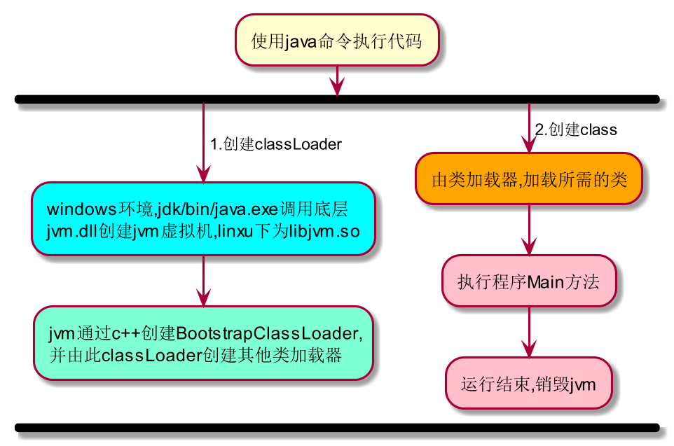
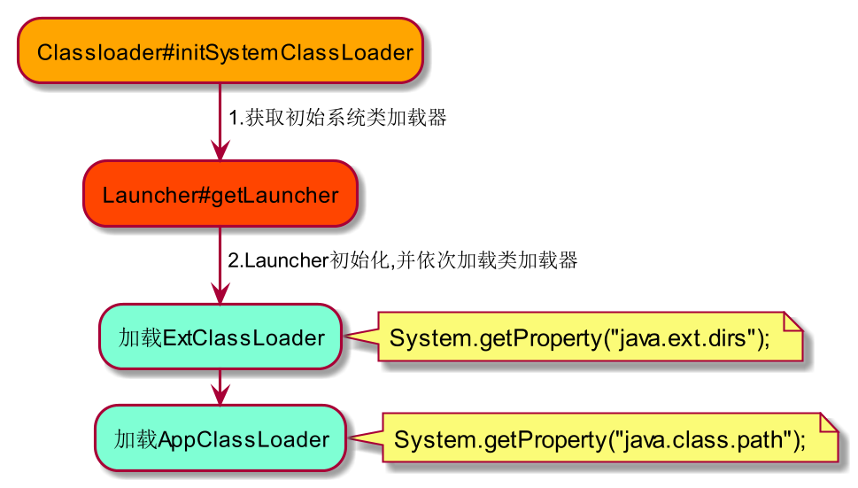
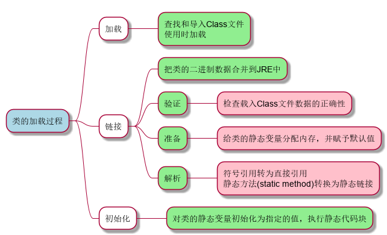

= java的类加载过程
:doctype: book
:encoding: utf-8
:lang: zh-cn
:toc: left
:toc-title: 导航目录
:toclevels: 4
:sectnums:
:sectanchors:

:hardbreaks:
:experimental:
:icons: font

pass:[<link rel="stylesheet" href="https://cdnjs.cloudflare.com/ajax/libs/font-awesome/4.7.0/css/font-awesome.min.css">]

== java命令执行代码流程

执行流程参考::
https://my.oschina.net/vbird/blog/1510800[jvm-启动流程-参考]

.java命令基础启动方式
[source]
----
java [<packageName>.]<className>

java -jar <jarName>.jar
----

.流程步骤的修改和创建

[TIP]
====
使用kbd:[locate libjvm.so]
可以快速地在linux下找到文件
====

== classLoader的加载过程

参考阅读-Launch-初始化过程::
https://blog.csdn.net/chaofanwei2/article/details/51335278[]

.类加载器初始化

[TIP]
====
String javaClassPath = System.getProperty("java.class.path");
你可以从java.class.path下拿到应用程序所属的类
====

====
[source,java]
----
/**
 * 类加载时，设置了ContextClassLoader
 */
ClassLoader scl = ClassLoader.initSystemClassLoader();
Thread.currentThread().setContextClassLoader(scl);<1>

/**
 * 若无指定，子线程继承父线程ContextClassLoader
 */
private Thread(...) {<2>
    
    Thread parent = currentThread();
    ...
    if (security == null || isCCLOverridden(parent.getClass()))
        this.contextClassLoader = parent.getContextClassLoader();
    else
        this.contextClassLoader = parent.contextClassLoader;
    ...
}
----
<1> java会在线程中设置线程上下文类加载器
<2> 子线程通过构造函数会继承父线程的contextClassLoader
====

== 类加载机制

参考阅读-类加载机制::
https://juejin.cn/post/6844903564804882445[]

.加载阶段
****
相对于类的加载过程的其他阶段，加载阶段是开发期相对来说可控性比较强，该阶段既可以使用系统提供的类加载器完成，也可以由用户自定义的类加载器来完成，开发人员可以通过定义自己的类加载器去控制字节流的获取方式
****

== 双亲委托与类的加载

推荐阅读-Tomcat类加载器::
https://juejin.cn/post/6844903550300979214[]

SPI的理解::
https://www.cnblogs.com/xrq730/p/11440174.html[]

=== 关于SPI中的类加载机制

通过线程上下文类加载器,SPI可以从AppClassLoader拿到对应的服务子类;

=== 关于tomcat的类加载机制

不同目录下的jar包的共享与隔离

image::image/01_tomcat_class_loader.png[800,600]

=== 类的卸载

link:..\src\main\java\indi\jdk\yufr\gc\LoadAndUnLoadClass.java[代码描述-LoadAndUnLoadClass.java,window=_blank]

- 该类所有的实例都已经被回收，也就是堆中不存在该类的任何实例。
- 加载该类的 ClassLoader 已经被回收。
- 该类对应的 Class 对象没有在任何地方被引用，也就无法在任何地方通过反射访问该类方法。

jvm-option: -Xnoclassgc 禁止类的卸载

[TIP]
====
在大量使用反射、动态代理、CGLib 等 ByteCode 框架、动态生成 JSP 以及 OSGi 这类频繁自定义
ClassLoader 的场景都需要虚拟机具备类卸载功能，以保证不会出现内存溢出。
====