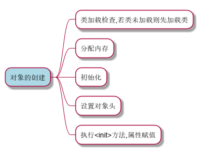
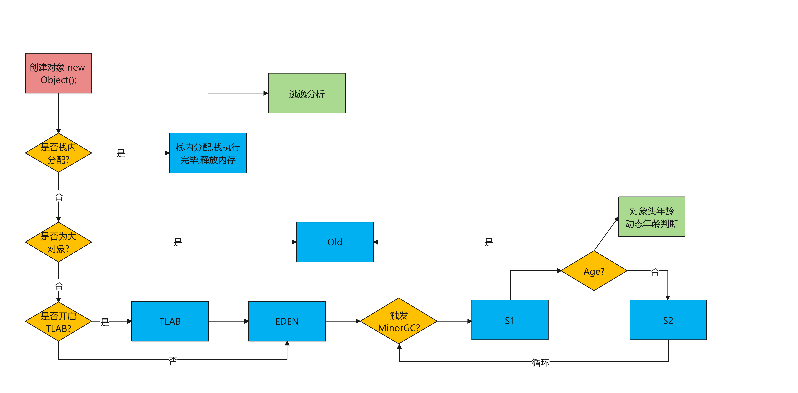
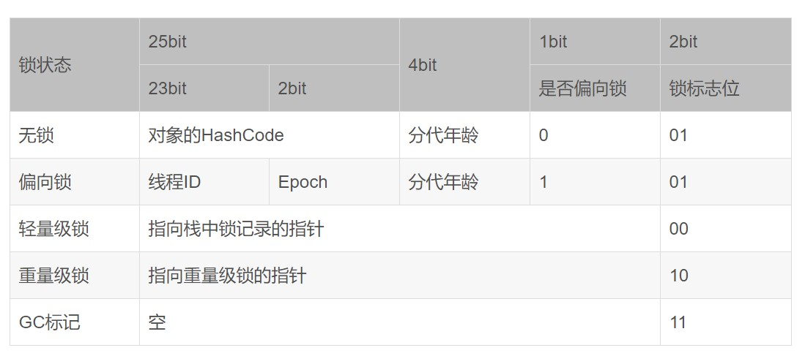

= 对象的创建与内存分配
:doctype: article
:encoding: utf-8
:lang: zh-cn
:toc: left
:toc-title: 导航目录
:toclevels: 4
:sectnums:
:sectanchors:

:hardbreaks:
:experimental:
:icons: font

pass:[<link rel="stylesheet" href="https://cdnjs.cloudflare.com/ajax/libs/font-awesome/4.7.0/css/font-awesome.min.css">]

== 对象的创建

推荐阅读-Java对象的创建过程::
https://blog.csdn.net/justloveyou_/article/details/72466416[]

.对象的创建

== 对象的创建时机

.对象的创建时机
[sorce]
----
- new 创建对象
- 反射机制 
* 使用Class类的newInstance方法(反射机制)
* 使用Constructor类的newInstance方法(反射机制)
- 使用clone(浅克隆/深克隆机制)
- 使用(反)序列化机制
----

序列化机制推荐阅读::
https://www.liaoxuefeng.com/wiki/1252599548343744/1298366845681698[]

[TIP]
====
[source]
----
public class StaticTest {
    static StaticTest st = new StaticTest();
    int a = 100;
    static int b = 200;
}
----
此例中实例的初始化嵌入到类的初始化流程;
实例会在类初始化阶段``属性赋值``,st{a=100,b=0}
按照代码顺序,b的初始化在 st实例之后,故b=0;
====

[TIP]
====
我们可以使用
javap -c xxx.class 将字节码指令,以反汇编的方式打印出来
[source]
----
0: aload_0
1: invokespecial #2                  // Method java/lang/Object."<init>":()V
----
invokespecial 预设调用构造器链
====

== 分配内存

推荐阅读-对象的分配::
https://www.cnblogs.com/myseries/p/12884249.html[]

=== 对象如何分配
****
指针碰撞::
假设Java堆是绝对规整的，所有用过的内存放在一边，空闲的内存放在另一边，中间放一个指针作为分界点的指示器。为对象分配内存时把那个指针向空闲空间那边挪动一段与对象大小相等的距离。

空闲列表::
Java堆中的内存不是规整的，以使用的内存和空闲的内存相互交错，无法使用指针碰撞。这时虚拟机就必须维护一个列表，记录上哪些内存是可用的，在分配内存的时候从列表中找一块足够大的空间划分给对象实例，并更新列表上的记录。

选择哪种分配方式由Java堆是否规整决定，而Java堆是否规整又由所采用的垃圾收集器是否带有压缩整理功能决定。
****

=== 解决并发问题的方法
****
CAS(compare and swap):: 虚拟机采用CAS配上失败重试的方式保证更新操作的原子性来对分配内存空间的动作进行同步处理。

TLAB(Thread Local Allocation Buffer)::
把内存分配的动作按照线程划分在不同的空间之中进行，即每个线程在Java堆中预先分配一小块内存。通过­XX:+/­ UseTLAB参数来设定虚拟机是否使用TLAB(JVM会默认开启­XX:+UseTLAB)，­XX:TLABSize 指定TLAB大小。
****

=== 分配内存过程图

.对象初始化
****
内存分配完成后，虚拟机需要将分配到的内存空间都初始化为零值（不包括对象头）， 如果使用TLAB，这一工作过程也 可以提前至TLAB分配时进行。这一步操作保证了对象的实例字段在Java代码中可以不赋初始值就直接使用，程序能访问 到这些字段的数据类型所对应的零值。
****

=== 对象头

推荐阅读-对象头和对象::
https://blog.csdn.net/lkforce/article/details/81128115[]

.JVM(32位)中Mark Word的存储内容

'''

.锁的状态变化
image::image/02_mark_word&lock.png[300,500]

'''

.执行<init>方法,属性赋值
****
执行<init>方法，即对象按照程序员的意愿进行初始化。对应到语言层面上讲，就是为属性赋值（注意，这与上面的赋 零值不同，这是由程序员赋的值），和执行构造方法。
****

=== 压缩指针

压缩指针的示意图::
https://gist.github.com/arturmkrtchyan/43d6135e8a15798cc46c#file-objectheader64-txt-L15[]

待阅读文章::
https://www.opsian.com/blog/jvm-tlabs-important-multicore/
https://www.opsian.com/blog/jvms-allocateprefetch-options/

