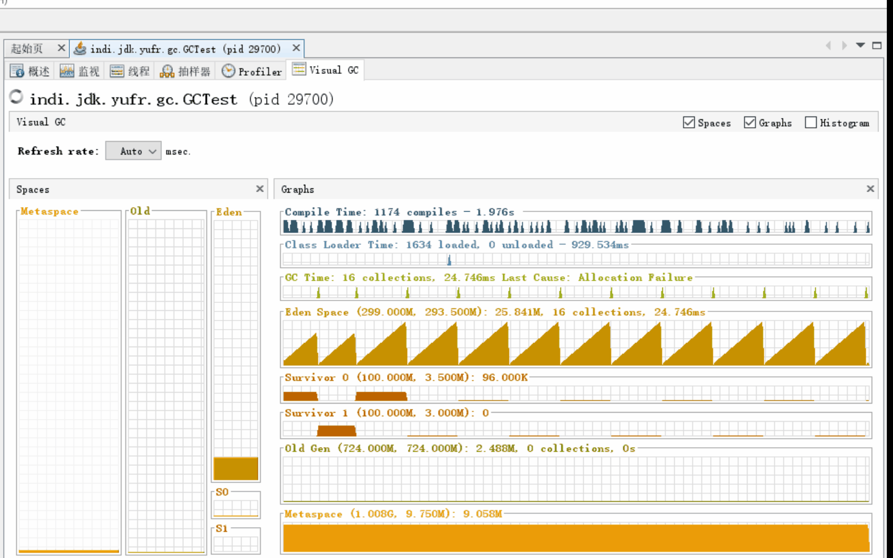
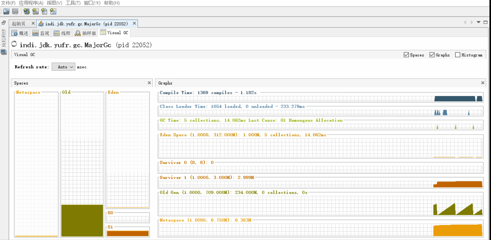

= jvm的内存模型
:doctype: article
:encoding: utf-8
:lang: zh-cn
:toc: left
:toc-title: 导航目录
:toclevels: 4
:sectnums:
:sectanchors:

:hardbreaks:
:experimental:
:icons: font

pass:[<link rel="stylesheet" href="https://cdnjs.cloudflare.com/ajax/libs/font-awesome/4.7.0/css/font-awesome.min.css">]

== jvm整体结构和内存模型

推荐阅读-jvm整体理解::
https://www.zybuluo.com/adamhand/note/1304953[window=_blank]

.jvm整体结构和内存模型
image::image/03_jvm_memory_molde.png[800,600]

== jvm内存参数设置

jdk15-jvm-option::
https://docs.oracle.com/en/java/javase/15/docs/specs/man/java.html[jdk15-官方文档-jvm参数,window=_blank]

参考阅读-内存配置参数::
https://cloud.tencent.com/developer/article/1406848[window=_blank]

.jvm内存参数
image::image/03_jvm_options.png[600,400]

'''

[source]
----
# java 命令参数设置
java -Xms2048m -Xmx2048m -Xmn1024m -Xss512k -XX:MetaspaceSize=256m -XX:MaxMetaspaceSize=256m ‐jar xxx.jar

# docker-compose设置options
version: '3.4'
services:
  ${java-service-name}:
    container_name: ${container-name}
    image: java:8-jre
    environment:
      - _JAVA_OPTIONS=-Xms2048m -Xmx2048m -Xmn1024m -Xss512k -XX:MetaspaceSize=256m -XX:MaxMetaspaceSize=256m
----

== gc的初步认识

=== gc的时机

Minor GC::
其触发条件非常简单，当 Eden 空间满时，就将触发一次Minor GC

Full GC::
- 手动触发System.gc()
- 老年代空间不足
- 担保失败

=== 对象进入老年代的契机
详看 02-对象的创建与内存分配中 分配内存过程图

- 大对象
- 存活年龄过长
-XX:MaxTenuringThreshold::
对象在年轻代-最大任期阈值
Sets the maximum tenuring threshold for use in adaptive GC sizing. The largest value is 15. The default value is 15 for the parallel (throughput) collector.
- 动态年龄判断
-XX:TargetSurvivorRatio::
young-gc之后,Survivor区域需要的百分比空间
Sets the desired percentage of survivor space (0 to 100) used after young garbage collection. By default, this option is set to 50%.

=== 担保机制

参考阅读-担保机制::
https://www.cnblogs.com/july-sunny/p/12618054.html[window=_blank]

在发生Minor GC之前，虚拟机会检查老年代最大可用的连续空间是否大于新生代所有对象的总空间，
如果大于，则此次Minor GC是安全的
如果小于，担保机制,会提前触发一次full-gc

=== gc-root

- 虚拟机栈中局部变量表中引用的对象
- 本地方法栈中 JNI(Java Native Interface，即一般所说的Native方法) 中引用的对象
- 方法区中类静态属性引用的对象
- 方法区中的常量引用的对象

link:..\src\main\java\indi\jdk\yufr\gc\GcRoot.java[代码描述-GcRoot.java,window=_blank]

=== 类的卸载

link:..\src\main\java\indi\jdk\yufr\gc\LoadAndUnLoadClass.java[代码描述-LoadAndUnLoadClass.java,window=_blank]

- 该类所有的实例都已经被回收，也就是堆中不存在该类的任何实例。
- 加载该类的 ClassLoader 已经被回收。
- 该类对应的 Class 对象没有在任何地方被引用，也就无法在任何地方通过反射访问该类方法。

jvm-option: -Xnoclassgc 禁止类的卸载

[TIP]
====
在大量使用反射、动态代理、CGLib 等 ByteCode 框架、动态生成 JSP 以及 OSGi 这类频繁自定义
ClassLoader 的场景都需要虚拟机具备类卸载功能，以保证不会出现内存溢出。
====

=== finalize

link:..\src\main\java\indi\jdk\yufr\gc\FinalizeEscapeGc.java[代码描述-FinalizeEscapeGc.java,window=_blank]

=== multi-reference

参考阅读::
https://docs.oracle.com/javase/8/docs/technotes/guides/vm/gctuning/considerations.html#sthref63[window=_blank]

link:..\src\main\java\indi\jdk\yufr\gc\MultiReference.java[代码描述-MultiReference.java,window=_blank]

=== can not escape(无法逃逸)

link:..\src\main\java\indi\jdk\yufr\gc\CanNotEscape.java[代码描述-CanNotEscape.java,window=_blank]

=== minor-gc (young gc)

link:..\src\main\java\indi\jdk\yufr\gc\MinorGc.java[代码描述-MinorGc.java,window=_blank]

以下测试实例，vm-option
-Xms1g -Xmx1g -Xmn300m

'''

.verbose:gc 描述
====
[source]
----
[GC (Allocation Failure) 298337K->2660K(1045504K), 0.0010237 secs]
----
<1> Allocation Failure 触发gc原因
<2> 298337K->2660K(1045504K) 
gc前年轻代大小->gc后年轻代大小(堆总的大小)
====

=== major-gc (full-gc)
场景:大对象直接进入到老年代导致full-gc

link:..\src\main\java\indi\jdk\yufr\gc\MajorGc.java[代码描述-MajorGc.java,window=_blank]

.verbose:gc 描述
====
[source]
----
[93.155s][info][gc] GC(6) Pause Young (Concurrent Start) (G1 Humongous Allocation) 466M->2M(1024M) 3.589ms
[93.155s][info][gc] GC(7) Concurrent Cycle
[93.158s][info][gc] GC(7) Pause Remark 4M->4M(1024M) 0.942ms
[93.159s][info][gc] GC(7) Pause Cleanup 4M->4M(1024M) 0.141ms
[93.160s][info][gc] GC(7) Concurrent Cycle 4.658ms
----
====

=== sof and oom

栈内存溢出::
java程序启动一个新线程时，没有足够的空间为改线程分配java栈，一个线程java栈的大小由-Xss设置决定；JVM则抛出OutOfMemoryError异常。

link:..src\main\java\indi\jdk\yufr\oom\StackOverFlowError.java[代码描述-StackOverFlowError,window=_blank]

堆内存溢出::
java堆用于存放对象的实例，当需要为对象的实例分配内存时，而堆的占用已经达到了设置的最大值(通过-Xmx)设置最大值，则抛出OutOfMemoryError异常。

推荐阅读-OutOfMemoryError系列::
https://blog.csdn.net/renfufei/article/details/76350794[window=_blank]

推荐阅读-OutofMemoryError-英文::
https://plumbr.io/outofmemoryerror[window=_blank]

