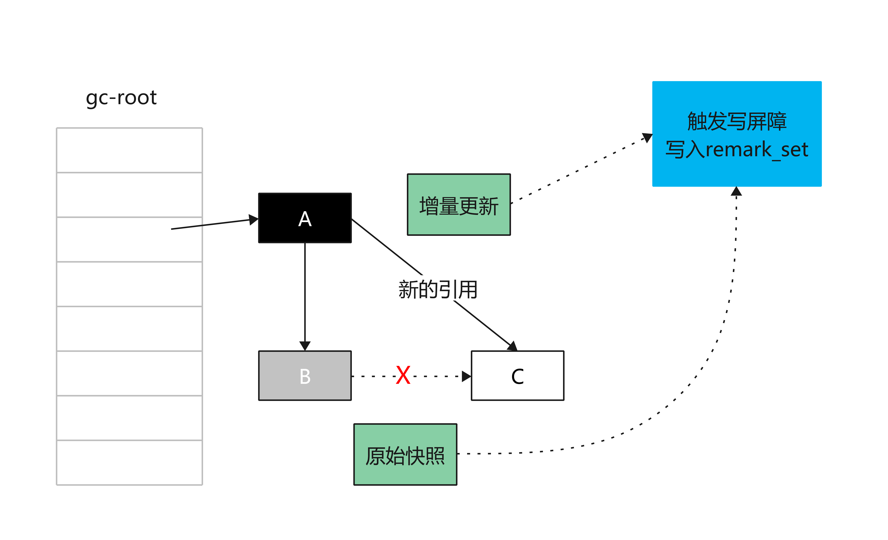

= 垃圾收集算法
:doctype: article
:encoding: utf-8
:lang: zh-cn
:toc: left
:toc-title: 导航目录
:toclevels: 4
:sectnums:
:sectanchors:

:hardbreaks:
:experimental:
:icons: font

pass:[<link rel="stylesheet" href="https://cdnjs.cloudflare.com/ajax/libs/font-awesome/4.7.0/css/font-awesome.min.css">]

[preface]
== jdk8-官网调优指南
https://docs.oracle.com/javase/8/docs/technotes/guides/vm/gctuning/[window=_blank]

== 基础的垃圾回收算法

=== 标记清除

=== 标记复制算法
image::image/04_gc_algorithm_copy.jpg[800,600]

=== 标记整理

image::image/04_gc_algorithm_markcompact.jpg[800,600]

== 标记算法-三色标记法

基础的垃圾回收算法为:标记-清除,标记-复制,标记-整理;
无论使用哪种算法,标记总是必要的一步;

三色标记:并发执行垃圾的标记,使标记阶段不影响用户程序;

并发标记的大致流程

image::image/04_concurrent_mark.jpg[800,600]

推荐阅读-维基百科::
https://en.wikipedia.org/wiki/Tracing_garbage_collection[]

[[tri-color-article,三色标记法与读写屏障]]
推荐阅读-三色标记法与读写屏障::
https://www.jianshu.com/p/12544c0ad5c1[]

=== 三色含义

白色::
表示对象尚未被垃圾收集器访问过; 显然在可达性分析初始阶段,所有的对象都是白色的;若在分析结束的阶段,仍然是白色的对象,即代表不可达

黑色::
表示对象已经被垃圾收集器访问过,且这个对象的所有引用都已经扫描过.黑色的对象代表已经扫描过,它是安全存活的， 如果有其他对象引用指向了黑色对象， 无须重新扫描一遍.黑色对象不可能直接(不经过灰色对象)指向某个白色对象.

灰色::
表示对象已经被垃圾收集器访问过但这个对象上至少存在一个引用还没有被扫描过.

维基百科中三色标记-清除图片解释

image::image/04_tri-color_garbage_collection.gif[]

1.初始时,均为白色(请以此为开始)
2.扫描gc-root;A,F变为灰色,E,G仍为白色(初始标记)
3.扫描A,F的成员变量(属性);A,F变为黑色;B,C,D变为灰色(并发标记)
4.最终回收E,G,H这三个白色节点(垃圾回收)

实际算法::
. 从灰色组中选择一个对象,然后将其移至黑色组;
. 将其引用的每个白色对象移至灰色组;这样可以确保该对象及其引用的任何对象都不能被垃圾回收;
. 重复以上两个步骤,直到灰色设置为空;

.三色标记会出现的问题
****
在标记对象是否存活的过程中，对象间的引用关系是不能改变的，这对于串行 GC 来说是可行的，因为此时应用程序处于 STW 状态。对于并发 GC 来说，在分析对象引用关系期间，对象间引用关系的建立和销毁是肯定存在的，如果没有其他补偿手段，并发标记期间就可能出现对象多标和漏标的情况
****

=== 多标

扫描到灰色节点时,灰色节点的父节点丢失了此引用

image::image/04_more_marked.png[800,600]

另外,针对并发标记(还有并发清理)开始后产生的新对象,通常的做法是直接全部当成黑色，本轮不会进行清除。这部分对象期间可能也会变为垃圾,这也算是浮动垃圾的一部分;

=== 漏标

. 黑色节点新增了对白色节点的引用
. 灰色节点删除了对白色节点的引用

link:..\src\main\java\indi\jdk\yufr\gc\ThreeColorMarked.java[代码描述-ThreeColorMarked.java,window=_blank]

[TIP]
====
多标,漏标 针对的都是黑色节点
多标了几个黑色节点;
漏标了几个黑色节点;
====

漏标导致正在使用对象被清除,需要防止

=== 漏标和读写屏障(最终标记-补偿标记)

增量更新(Incremental Update)::
当黑色对象插入新的指向白色对象的引用关系时,(写处理,a.c=c);
记录此新增引用的白色节点,等并发标记结束之后,重新扫描;

原始快照(Snapshot At The Beginning,SATB)::
原始快照就是当灰色对象要删除指向白色对象的引用关系时,(写处理,a.b.c=null);
记录此删除引用的白色节点,等并发标记结束之后,重新扫描;

详细内容查看<<tri-color-article>>

[TIP]
====
记忆点:
新增->黑指白->更新引用值->在写之后操作->增量更新
删除->灰删白->保存删除前的对象->在写前进行操作->原始快照
====

=== 三色标记法与现代垃圾回收器

对于读写屏障，以Java HotSpot VM为例，其并发标记时对漏标的处理方案如下:

. CMS: 写屏障 + 增量更新
. G1: 写屏障 + SATB
. ZGC: 读屏障

推荐阅读-G1学习笔记::
https://zhuanlan.zhihu.com/p/54048685[]

参考阅读-R大关于G1的问答::
https://hllvm-group.iteye.com/group/topic/44381

抽个时间学习下c++,看懂R大c语言相关的回答

[TIP]
====
CMS的incremental update设计使得它在remark阶段必须重新扫描所有线程栈和整个young gen作为root;G1的SATB设计在remark阶段则只需要扫描剩下的satb_mark_queue;
====

参考阅读-垃圾回收算法::
https://developer.aliyun.com/article/777750[]

== 其他垃圾回收算法

[[Generational-Collection]]
=== 分代算法[Generational-Collection]

参考阅读-分代算法::
https://www.jianshu.com/p/671495682e46[]

跨代/区之间对象的引用,分代GC时需要做到不进行跨代扫描;

1-跨代引用皆为gc-root,以保证分代gc时不漏标对象

2-当触发跨代引用,使用写屏障,将跨代引用放入记录集

image::image/04_separatarion_generation_gc_root.png[800,600]

[TIP]
====
准确说记忆集[remebered set]为gc-root
====

=== 增量算法[increment-gc]
