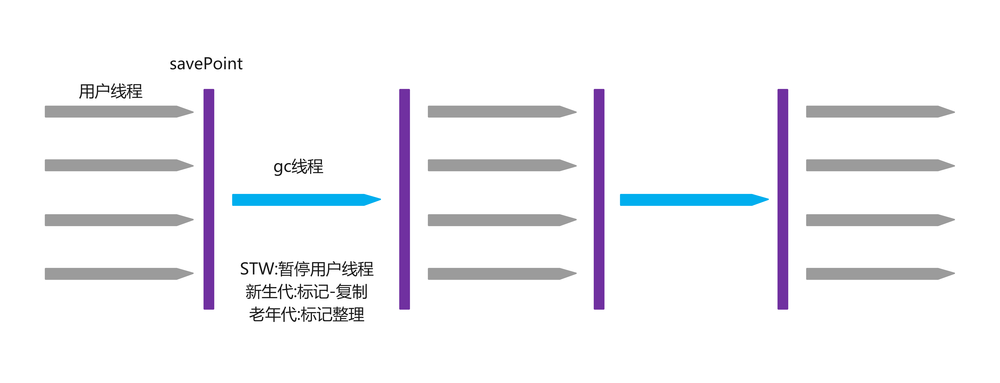
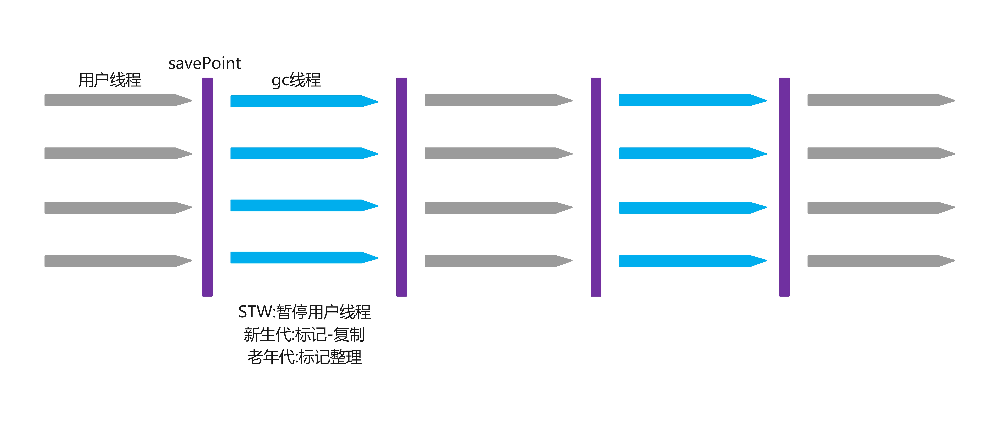
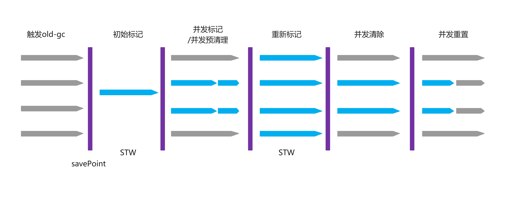

= G1&ZGC
:doctype: article
:encoding: utf-8
:lang: zh-cn
:toc: left
:toc-title: 导航目录
:toclevels: 4
:sectnums:
:sectanchors:

:hardbreaks:
:experimental:
:icons: font

pass:[<link rel="stylesheet" href="https://cdnjs.cloudflare.com/ajax/libs/font-awesome/4.7.0/css/font-awesome.min.css">]

== 垃圾收集器发展简史
- 1999年随JDK1.3.1一起来的是串行方式的Serial GC,它是第一款GC收集器;ParNew是Serial的多线程版本;
- 2002年2月26日,Parallel GC和Concurrent Mark Sweep GC跟随JDK1.4.2一起发布Parallel GC在JDK6之后成为HotSpot默认GC;
- 2012年,在JDK1.7u4版本中，G1可用;
- 2017年,JDK9中G1变成默认的垃圾收集器,以替代CMS;
- 2018年3月,JDK10中G1垃圾回收器的并行完整垃圾回收,实现并行性来改善最坏情况下的延迟;
------------分水岭------------
- 2018年9月,JDK11发布;引入Epsilon垃圾回收器,又被称为"No一0p(无操作)"回收器;同时,引入ZGC:可伸缩的低延迟垃圾回收器（Experimental）。
- 2019年3月,JDK12发布,增强G1,自动返回未用堆内存给操作系统;同时,引入Shenandoah GC:低停顿时间的GC(Experimental);
- 2019年9月,JDK13发布;增强ZGC,自动返回未用堆内存给操作系统;
- 2020年3月,JDK14发布,删除CMS垃圾回收器;扩展ZGC在macOS和Windows上的应用;

== gc的分类

image::image/05.1_gc_types.png[1000,800]

对应组合的jvm-options

[width="100%",options="header"]
|====================
|Young| 	                Tenured| 	        JVM options
|Incremental| 	        Incremental| 	        -Xincgc
|Serial| 	                Serial| 	        -XX:+UseSerialGC
|Parallel Scavenge| 	        Serial| 	    -XX:+UseParallelGC -XX:-UseParallelOldGC
|Parallel New| 	        Serial| 	            N/A
|Serial| 	                Parallel Old| 	    N/A
|Parallel Scavenge| 	        Parallel Old| 	-XX:+UseParallelGC -XX:+UseParallelOldGC
|Parallel New| 	        Parallel Old| 	        N/A
|Serial| 	                CMS| 	            -XX:-UseParNewGC -XX:+UseConcMarkSweepGC
|Parallel Scavenge|       	CMS| 	            N/A
|Parallel New| 	        CMS| 	                -XX:+UseParNewGC -XX:+UseConcMarkSweepGC
|G1| 	                   |                    -XX:+UseG1GC
|====================

#查看垃圾收集器#
方法1: -XX:+PrintCommandLineFlags
方法2: 使用命令行指令 jinfo -flags $pid

== Serial&Serial-Old

推荐阅读-Serial GC::
https://juejin.cn/post/6844903887107784712[]

== Parallel-Scavenge&Parallel-Old&Parallel-New

设定gc线程数量::
-XX:ParallelGCThreads=threads
Sets the number of threads used for parallel garbage collection in the young and old generations. The default value depends on the number of CPUs available to the JVM.

=== Parallel-Scavenge&Parallel-Old

推荐阅读-Parallel-Scavenge::
https://www.jianshu.com/p/764f93fac5f3[]

Parallel-Scavenge的目标是达到一个可控的吞吐量;

Throughput of gc::
GC的吞吐量=程序运行时间/(程序运行时间+GC时间);

和吞吐量相关的参数

参考阅读-吞吐量相关参数::
https://www.cnblogs.com/hellxz/p/14056403.html[]

-XX:GCTimeRatio=nnn::
A hint to the virtual machine that it's desirable that not more than 1 / (1 + nnn) of the application execution time be spent in the collector.
For example -XX:GCTimeRatio=19 sets a goal of 5% of the total time for GC and throughput goal of 95%. That is, the application should get 19 times as much time as the collector.

By default the value is 99, meaning the application should get at least 99 times as much time as the collector. That is, the collector should run for not more than 1% of the total time. This was selected as a good choice for server applications. A value that is too high will cause the size of the heap to grow to its maximum.

-XX:MaxGCPauseMillis=nnn::
A hint to the virtual machine that pause times of nnn milliseconds or less are desired. The VM will adjust the java heap size and other GC-related parameters in an attempt to keep GC-induced pauses shorter than nnn milliseconds. Note that this may cause the VM to reduce overall throughput, and in some cases the VM will not be able to meet the desired pause time goal.
By default there is no pause time goal. There are definite limitations on how well a pause time goal can be met. The pause time for a GC depends on the amount of live data in the heap. The minor and major collections depend in different ways on the amount of live data. This parameter should be used with caution. A value that is too small will cause the system to spend an excessive amount of time doing garbage collection.

[TIP]
====
GCTimeRatio MaxGCPauseMillis不要一起指定;
低延时和高吞吐是相互对立的;
====

== CMS(ConcMarkSweepGC)

CMS-GC 老年代-标记清除(涉及跨代引用)

推荐阅读-cms-算法::
https://plumbr.io/handbook/garbage-collection-algorithms-implementations#concurrent-mark-and-sweep[垃圾回收算法#cms]
详细说明了cms回收的6个阶段;

CMS垃圾回收的6个重要阶段::
. initial-mark
初始标记(CMS的第一个STW阶段),标记GC-Root直接引用的对象,GC-Root直接引用的对象不多,所以很快;
. concurrent-mark
并发标记阶段,由第一阶段标记过的对象出发,所有可达的对象都在本阶段标记;
. concurrent-preclean 
并发预清理阶段,也是一个并发执行的阶段;在本阶段,会查找前一阶段执行过程中,从新生代晋升或新分配或被更新的对象;通过并发地重新扫描这些对象，预清理阶段可以减少下一个stop-the-world 重新标记阶段的工作量;
. concurrent-abortable-preclean
并发可中止的预清理阶段;这个阶段其实跟上一个阶段做的东西一样,也是为了减少下一个STW重新标记阶段的工作量;增加这一阶段是为了让我们可以控制这个阶段的结束时机,比如扫描多长时间(默认5秒)或者Eden区使用占比达到期望比例(默认50%)就结束本阶段;
. remark
重标记阶段(CMS的第二个STW阶段),暂停所有用户线程,从GC-Root开始重新扫描整堆,标记存活的对象;需要注意的是,虽然CMS只回收老年代的垃圾对象，但是这个阶段依然需要扫描新生代,因为很多GC-Root都在新生代,而这些GC-Root指向的对象又在老年代,这称为“跨代引用”;
. concurrent-sweep
并发清理;

CMS的相关核心参数::
. -XX:+UseConcMarkSweepGC:启用cms 
. -XX:ConcGCThreads:并发的GC线程数 
. -XX:+UseCMSCompactAtFullCollection:FullGC之后做压缩整理(减少碎片)
. -XX:CMSFullGCsBeforeCompaction:多少次FullGC之后压缩一次,默认是0,代表每次FullGC后都会压缩一 次
. -XX:CMSInitiatingOccupancyFraction: 当老年代使用达到该比例时会触发FullGC(默认是92,这是百分比)
. -XX:+UseCMSInitiatingOccupancyOnly:只使用设定的回收阈值(-XX:CMSInitiatingOccupancyFraction设 定的值),如果不指定,JVM仅在第一次使用设定值,后续则会自动调整 
. -XX:+CMSScavengeBeforeRemark:在CMS GC前启动一次minor-gc,目的在于减少老年代对年轻代的引用,降低CMS-GC的标记阶段时的开销,一般CMS的GC耗时80%都在标记阶段 
. -XX:+CMSParallellnitialMarkEnabled:表示在初始标记的时候多线程执行,缩短STW 
. -XX:+CMSParallelRemarkEnabled:在重新标记的时候多线程执行,缩短STW;
