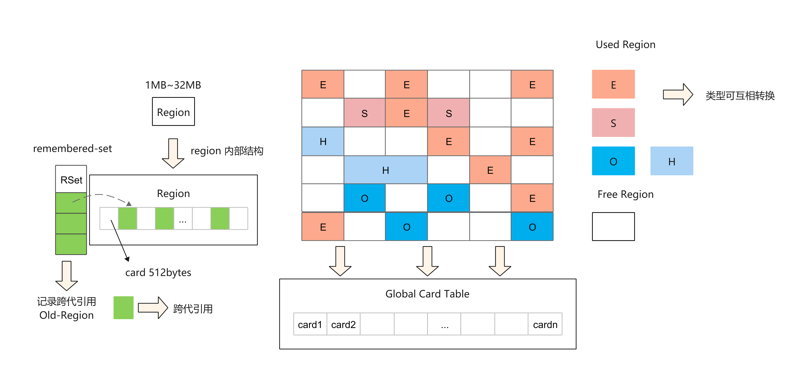
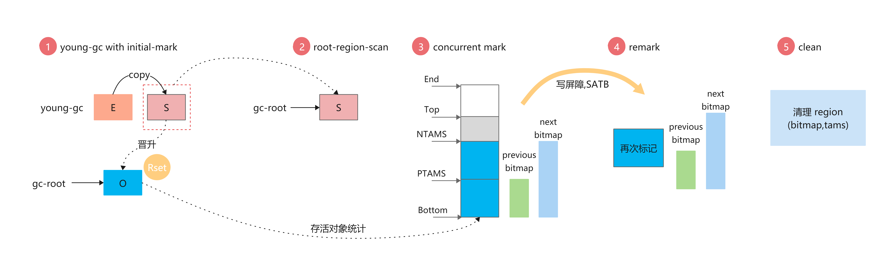
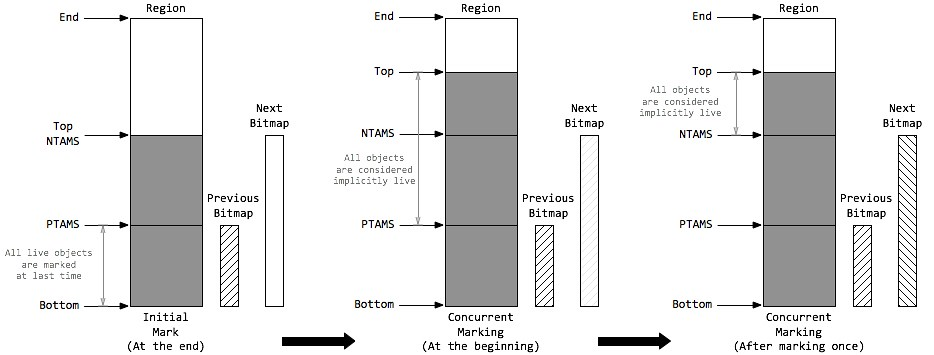

= Serial&Parallel&CMS
:doctype: article
:encoding: utf-8
:lang: zh-cn
:toc: left
:toc-title: 导航目录
:toclevels: 4
:sectnums:
:sectanchors:

:hardbreaks:
:experimental:
:icons: font

pass:[<link rel="stylesheet" href="https://cdnjs.cloudflare.com/ajax/libs/font-awesome/4.7.0/css/font-awesome.min.css">]

== G1

推荐阅读-oracle-g1-官方文档::
https://www.oracle.com/technetwork/tutorials/tutorials-1876574.html[]

推荐阅读-g1-算法::
https://www.cnblogs.com/GrimMjx/p/12234564.html[]

推荐阅读-g1-算法::
https://blog.csdn.net/coderlius/article/details/79272773[]

推荐阅读-g1-算法::
https://plumbr.io/handbook/garbage-collection-algorithms-implementations#g1[垃圾回收算法#g1]

G1的特性

. G1的设计原则是"首先收集尽可能多的垃圾(Garbage First)"。因此，G1并不会等内存耗尽(串行、并行)或者快耗尽(CMS)的时候开始垃圾收集，而是在内部采用了启发式算法，在老年代找出具有高收集收益的分区进行收集。同时G1可以根据用户设置的暂停时间目标自动调整年轻代和总堆大小，暂停目标越短年轻代空间越小、总空间就越大；
. G1采用内存分区(Region)的思路，将内存划分为一个个相等大小的内存分区，回收时则以分区为单位进行回收，存活的对象复制到另一个空闲分区中。由于都是以相等大小的分区为单位进行操作，因此G1天然就是一种压缩方案(局部压缩)；
. G1虽然也是分代收集器，但整个内存分区不存在物理上的年轻代与老年代的区别，也不需要完全独立的survivor(to space)堆做复制准备。G1只有逻辑上的分代概念，或者说每个分区都可能随G1的运行在不同代之间前后切换；
. G1的收集都是STW的，但年轻代和老年代的收集界限比较模糊，采用了混合(mixed)收集的方式。即每次收集既可能只收集年轻代分区(年轻代收集)，也可能在收集年轻代的同时，包含部分老年代分区(混合收集)，这样即使堆内存很大时，也可以限制收集范围，从而降低停顿。

=== G1垃圾收集分类

YoungGC::
YoungGC并不是说现有的Eden区放满了就会马上触发，G1会计算下现在Eden区回收大概要多久时间，如果回收时间远远小于参数-XX:MaxGCPauseMills设定的值，那么增加年轻代的region，继续给新对象存放，不会马上做Young-GC，直到下一次Eden区放满，G1计算回收时间接近参数-XX:MaxGCPauseMills设定的值，那么就会触发Young GC

MixedGC::
老年代的堆占有率达到参数(-XX:InitiatingHeapOccupancyPercent)设定的值则触发，回收所有的 Young和部分Old(根据期望的GC停顿时间确定old区垃圾收集的优先顺序)以及大对象区，正常情况G1的垃圾收集是先做MixedGC，主要使用复制算法，需要把各个region中存活的对象拷贝到别的region里去，拷贝过程中如果发现没有足够的空region能够承载拷贝对象就会触发一次Full GC 

Full GC::
停止系统程序，然后采用单线程进行标记、清理和压缩整理，好空闲出来一批Region来供下一次MixedGC使用，这 个过程是非常耗时的。(Shenandoah优化成多线程收集了)

image::image/05.2_g1_gc_activities.png[1000,800]

=== g1-young-gc
实际g1-young-gc-处理细节查看
Evacuation Pause: Fully Young
https://plumbr.io/handbook/garbage-collection-algorithms-implementations#g1[垃圾回收算法#g1]

[source]
----
[GC pause (G1 Evacuation Pause) (young), 0.0829298 secs]
   [Parallel Time: 75.1 ms, GC Workers: 8]
      [GC Worker Start (ms): Min: 1530.1, Avg: 1530.1, Max: 1530.3, Diff: 0.3]
      [Ext Root Scanning (ms): Min: 0.0, Avg: 0.2, Max: 0.3, Diff: 0.3, Sum: 1.5]
      [Update RS (ms): Min: 4.2, Avg: 11.8, Max: 32.5, Diff: 28.2, Sum: 94.1]
         [Processed Buffers: Min: 1, Avg: 2.6, Max: 3, Diff: 2, Sum: 21]
      [Scan RS (ms): Min: 0.0, Avg: 0.2, Max: 1.5, Diff: 1.5, Sum: 2.0]
      [Code Root Scanning (ms): Min: 0.0, Avg: 0.0, Max: 0.0, Diff: 0.0, Sum: 0.0]
      [Object Copy (ms): Min: 42.1, Avg: 62.6, Max: 68.9, Diff: 26.8, Sum: 500.9]
      [Termination (ms): Min: 0.0, Avg: 0.1, Max: 0.1, Diff: 0.1, Sum: 0.6]
         [Termination Attempts: Min: 1, Avg: 2.8, Max: 6, Diff: 5, Sum: 22]
      [GC Worker Other (ms): Min: 0.0, Avg: 0.1, Max: 0.1, Diff: 0.1, Sum: 0.5]
      [GC Worker Total (ms): Min: 74.8, Avg: 74.9, Max: 75.0, Diff: 0.3, Sum: 599.5]
      [GC Worker End (ms): Min: 1605.0, Avg: 1605.1, Max: 1605.1, Diff: 0.1]
   [Code Root Fixup: 0.0 ms]
   [Code Root Purge: 0.0 ms]
   [Clear CT: 0.2 ms]
   [Other: 7.6 ms]
      [Choose CSet: 0.0 ms]
      [Ref Proc: 0.5 ms]
      [Ref Enq: 0.0 ms]
      [Redirty Cards: 0.2 ms]
      [Humongous Register: 0.1 ms]
      [Humongous Reclaim: 0.0 ms]
      [Free CSet: 0.8 ms]
   [Eden: 172.0M(172.0M)->0.0B(198.0M) Survivors: 22.0M->25.0M Heap: 999.7M(3248.0M)->1001.7M(3407.0M)]
 [Times: user=0.38 sys=0.11, real=0.08 secs]  
----

=== g1-concurrent-mark-cycle

[source]
----
[GC pause (G1 Humongous Allocation) (young) (initial-mark), 0.0285291 secs]
[GC concurrent-root-region-scan-start]
[GC concurrent-root-region-scan-end, 0.0008580 secs]
[GC concurrent-mark-start]
[GC concurrent-mark-end, 0.0609727 secs]
[GC remark [Finalize Marking, 0.0002842 secs] [GC ref-proc, 0.0001485 secs] [Unloading, 0.0007599 secs], 0.0025002 secs]
 [Times: user=0.00 sys=0.00, real=0.00 secs] 
[GC cleanup 238M->238M(508M), 0.0013998 secs]
 [Times: user=0.00 sys=0.00, real=0.00 secs] 
----

并发标记示意图

Concurrent Marking Threads

[TIP]
====
top at mark start (TAMS)
====

=== g1-mixed-collection-cycle

单次的混合收集与年轻代收集并无二致。根据暂停目标，老年代的分区可能不能一次暂停收集中被处理完，G1会发起连续多次的混合收集，称为混合收集周期(Mixed Collection Cycle)。G1会计算每次加入到CSet中的分区数量、混合收集进行次数，并且在上次的年轻代收集、以及接下来的混合收集中，G1会确定下次加入CSet的分区集(Choose CSet)，并且确定是否结束混合收集周期。

=== 相关优化参数

. -XX:+UseG1GC
使用G1收集器 
. -XX:ParallelGCThreads
指定GC工作的线程数量 
. -XX:G1HeapRegionSize
指定分区大小(1MB~32MB，且必须是2的N次幂)，默认将整堆划分为2048个分区 
. -XX:MaxGCPauseMillis
young-gc,mixed-gc的暂停时间(默认200ms) 
. -XX:G1NewSizePercent
新生代内存初始空间(默认整堆5%) 
. -XX:G1MaxNewSizePercent
新生代内存最大空间
. -XX:InitiatingHeapOccupancyPercent
老年代占用空间达到整堆内存阈值(默认45%)，则执行新生代和老年代的混合收集(MixedGC)，比如我们之前说的堆默认有2048个region，如果有接近1000个region都是老年代的region，则可能 就要触发MixedGC了 
. -XX:G1MixedGCLiveThresholdPercent
默认85%，region中的存活对象低于这个值时才会回收该region，如果超过这个值，存活对象过多，回收的的意义不大。
. -XX:G1MixedGCCountTarget
在一次回收过程中指定做几次筛选回收(默认8次)，在最后一个筛选回收阶段可以回收一会，然后暂停回收，恢复系统运行，一会再开始回收，这样可以让系统不至于单次停顿时间过长。 
. -XX:G1HeapWastePercent(默认5%)
Sets the percentage of heap that you're willing to waste. The Java HotSpot VM doesn't initiate the mixed garbage collection cycle when the reclaimable percentage is less than the heap waste percentage. The default is 5 percent.
默认值5%，也就是在并发标记周期结束后能够统计出所有可被回收的垃圾占Heap的比例值，如果超过5%，那么就会触发之后的多轮Mixed GC，mixed gc会同时回收年轻代+老年代，而这个参数可以指定mixed gc触发的时机。

== ZGC

推荐阅读-官方文档::
https://wiki.openjdk.java.net/display/zgc[]

推荐阅读-美团-zgc::
https://tech.meituan.com/2020/08/06/new-zgc-practice-in-meituan.html[]

https://wiki.openjdk.java.net/display/zgc[]

https://malloc.se/blog/zgc-jdk15[]

[width="100%",options="header,footer"]
|====================
|General GC Options  |ZGC Options  |ZGC Diagnostic Options (-XX:+UnlockDiagnosticVMOptions)  
|
-XX:MinHeapSize, -Xms
-XX:InitialHeapSize, -Xms
-XX:MaxHeapSize, -Xmx
-XX:SoftMaxHeapSize
-XX:ConcGCThreads
-XX:ParallelGCThreads
-XX:UseLargePages
-XX:UseTransparentHugePages
-XX:UseNUMA
-XX:SoftRefLRUPolicyMSPerMB
-XX:AllocateHeapA

|
-XX:ZAllocationSpikeTolerance

-XX:ZCollectionInterval

-XX:ZFragmentationLimit

-XX:ZMarkStackSpaceLimit

-XX:ZProactive

-XX:ZUncommit

-XX:ZUncommitDelay
|
-XX:ZStatisticsInterval

-XX:ZVerifyForwarding

-XX:ZVerifyMarking

-XX:ZVerifyObjects

-XX:ZVerifyRoots

-XX:ZVerifyViews
|====================
