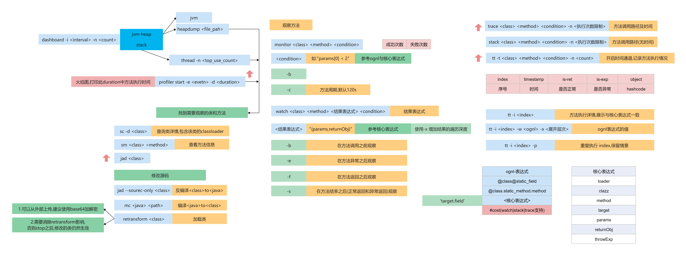

= java调优
:doctype: article
:encoding: utf-8
:lang: zh-cn
:toc: left
:toc-title: 导航目录
:toclevels: 4
:sectnums:
:sectanchors:

:hardbreaks:
:experimental:
:icons: font

pass:[<link rel="stylesheet" href="https://cdnjs.cloudflare.com/ajax/libs/font-awesome/4.7.0/css/font-awesome.min.css">]

== jdk tool api

常用命令
[source]
----
# jmap查看堆信息
jmap -histo $pid

jmap -heap $pid

# 堆dump
jmap -dump:format=b,file=<application_name>.hprof $pid

# 保存在本地,使用工具查看
scp <remote_user>@<remote_ip>:<remote_dir>/<application_name>.hprof <local_dir>

# 堆溢出时自动导出
-XX:+HeapDumpOnOutOfMemoryError -XX:HeapDumpPath=./

# jstack查看线程信息
jstack $pid

# 查看指定进程
top -H -p <pid>
# 使用 -H 查看threads 找到cpu使用率高的线程
# 将线程的pid,转换为16进制,
# 如进程的pid为4466,线程的pid为4467,4467=>0x1173
jstack 4466 | grep -A 10 4467
# 此命令查看此线程运行详情

# jinfo,查看应用程序的扩展参数
# jvm配置参数
jinfo -flags $pid
# java系统参数
jinfo -sysprops $pid
----

推荐阅读-jstat:
https://docs.oracle.com/en/java/javase/15/docs/specs/man/jstat.html[javase-15-specs-jstat]

[source]
----
# jstat,统计工具(gc的分析)

jstat outputOptions [-t] [-h lines] vmid [interval [count]]

jstat -gc
jstat -gccapacity
jstat -gcnew
jstat -gcnewcapacity
jstat -gcold
jstat -gcoldcapacity
jstat -gcmetacapacity
jstat -gcutil
jstat -gccause

jstat -gc $pid 最常用，可以评估程序内存使用及GC压力整体情况

常用示例: jstat -gc $pid 300000 10
每300000ms执行一次命令,总共执行10次

执行 jstat -gc $pid 300000 10,观察eden,survivor,old的区内存变化情况
----

== arthas-开源诊断工具

相对于 jdk-tool 更加高效

arthas-官方文档::
https://arthas.aliyun.com/doc/[]

[source]
----
# 下载
curl -sk https://arthas.aliyun.com/arthas-boot.jar -o ~/.arthas-boot.jar

# 配置别名as.sh,并生效,交互式非登陆生效
echo "alias as.sh='java -jar ~/.arthas-boot.jar --repo-mirror aliyun --use-http 2>&1'" >> ~/.bashrc && source ~/.bashrc

# 登陆式生效
echo "source ~/.bashrc" >> ~/.bash_profile
&& source ~/.bash_profile

# 当然也可以选择配置在 /etc/bash_profile /etc/bashrc文件中
----

linux-centos-yum安装openjdk::
https://www.cnblogs.com/yaun1498078591/p/10368884.html[]

关于“.bash_profile”和“.bashrc”区别的总结::
https://blog.csdn.net/sch0120/article/details/70256318[]

使用别名执行 arthas
[source]
----
as.sh
----

初级教程-arthas-quick-start::
https://arthas.aliyun.com/doc/quick-start.html[]

使用arthas-quick-start提供的demo-jar包,可以开始命令的使用;

=== help

[source]
----
# help 帮助你快速理解所有命令的含义
help
----

=== gc日志分析

-Xloggc:./gc-%t.log

gc日志与垃圾收集器相关,详细查看05篇章中不同垃圾收集器;

=== jvm相关

==== dashboard
使用 dashboard 命令查看对应进程运行情况

wiki-dashboard::
https://arthas.aliyun.com/doc/dashboard[]

[source]
----
dashboard [-h] [-i <value>] [-n <value>]
# 使用 dashboard -h 可以得到很多帮助
# wiki: 

# 常用示例
dashboard -i 300000 -n 1
----

根据dashboard展示的线程,内存分析

==== thread
使用 thread命令,分析线程

wiki-thread::
https://arthas.aliyun.com/doc/thread[]

[source]
----
# 常用命令

# cpu使用率最高的3个线程
thread -n 3

# 这里的cpu使用率与top -H -p <pid>中%cpu是一致的

# 查看阻塞的线程
# 目前只支持找出synchronized关键字阻塞住的线程
thread -b

# 线程按状态分类
thread -state ${state}
# 可选值为NEW, RUNNABLE, TIMED_WAITING, WAITING, BLOCKED, TERMINATED
# 关于线程,详见之后的多线程篇章

# 统计最近1000ms内的线程CPU时间
thread -i 1000
----

进阶教程-arthas-advanced-use::
https://arthas.aliyun.com/doc/advanced-use.html[]

==== jvm

wiki-jvm::
https://arthas.aliyun.com/doc/jvm.html[]

[source]
----
# 查看jvm信息以及gc-统计情况
jvm
----

==== vmoption

wiki-vmoption::
https://arthas.aliyun.com/doc/vmoption.html[]

[source]
----
# -XX:+PrintFlagsFinal
# 打印jvm参数
vmoption
----

==== ognl

apache-ognl::
https://commons.apache.org/proper/commons-ognl/index.html[]

wiki-ognl::
https://arthas.aliyun.com/doc/ognl.html[]

执行ognl-表达式
[source]
----
# 执行静态方法
ognl '@java.lang.System@out.println("hello")'

# 获取静态变量
ognl '@Demo@staticFiled'

# 使用getstatic 获取静态变量
getstatic class_name field_name
----

[TIP]
====
使用 -c <hashcode> 或 --classLoaderClass <className>指定类加载器

example::
ognl --classLoaderClass org.springframework.boot.loader.LaunchedURLClassLoader  @org.springframework.boot.SpringApplication@logger
====

结合 springContext.getBean("className")
通过ognl可以获取对象,然后执行方法

example
[source]
----
ognl -c <hashcode> <springContext>.getBean("beanName").<method()>
----

=== class/classloader相关

==== sc
sc => search-class
[source]
----
# 模糊查询类
sc <package_name.>*

# 打印类的信息
# 其中包含类加载的hashcode
sc -d

# 打印类的信息与字段信息
sc -d -f
----

==== sm
sm => search-method

[source]
----
# 查看类的所有方法
sm <class>

# 查看方法detail
sm -d <class> <method>
----

==== jad

wiki-jad::
https://arthas.aliyun.com/doc/jad.html[]

反编译代码

[source]
----
# 默认显示行号,classloader
jad <class>

# 不显示classloader
# 与mc-retransform结合实现热部署代码
jad --source-only <class>

# 反编译指定方法
jad <class> <method>

#不显示行号
jad <class> --line-number false
----

==== mc

Memory Compiler/内存编译器，编译.java文件生成.class

[source]
----
# 编译java文件
mc <java>

# 指定dir,输出结果文件
mc -d <output-dir> <java>
----

==== retransform&&redefine

wiki-retransform::
https://arthas.aliyun.com/doc/retransform.html[]

加载外部的.class文件，retransform jvm已加载的类。

[source]
----
# 每加载一个.class文件，则会记录一个retransform-entry.
# 默认执行显示触发
retransform <class>

# 查看retransform-entry
retransform -l

# 删除retransform-entry
retransform -d <id>
retransform --deleteAll

# 显示触发
retransform --classPattern demo.MathGame
----

[TIP]
====
注意使用retransform之后需要消除影响!
详见wiki-文档!
====

wiki-redefine::
https://arthas.aliyun.com/doc/redefine.html[]
[source]
----
redefine <class>
----

=== monitor/watch/trace相关

==== monitor
----
# 监控方法的运行情况
# 默认统计周期 -c 120(单位s)
monitor <class> <method>

# 按条件过滤统计结果
# 默认是方法执行之后
monitor <class> <method> "params[0] <= 2"

# 方法执行之前
monitor -b <class> <method> "params[0] <= 2"

# 解释: 参数0在执行中,会修改值;因此需要区分;

如此例,方法执行之前的参数和执行完毕的值是不一致的
void work(int i) {
    i = i+1;
}
----

==== watch

方法执行数据观测

wiki-watch::
https://arthas.aliyun.com/doc/watch.html[]

[source]
----
# 返回结果即有params和returnObj组成
watch <class> <method> "{params,returnObj}" -x 2
----

==== trace

方法内部调用路径，并输出方法路径上的每个节点上耗时

trace-wiki::
https://arthas.aliyun.com/doc/trace.html[]

[source]
----
trace <class> <method>
----

====

[source]
----
# 开启时空通道,记录指定方法
tt -t <class> <method> -n 20

重新触发情景 tt -p -i <index>
查看第一个参数 tt  -w params[0] -i <index> 
查看方法执行参数 tt  -w '{method.name,params,returnObj,throwExp}' -x 3 -i <index>
周期性执行 tt -p --replay-times 3 --replay-interval 2000 -i <index>
时光隧道列表 tt -l
删除时光隧道列表 tt --delete-all
----

==== async-profiler

[source]
----
profiler start --event cpu --interval 10000000 --format svg -duration 100
----