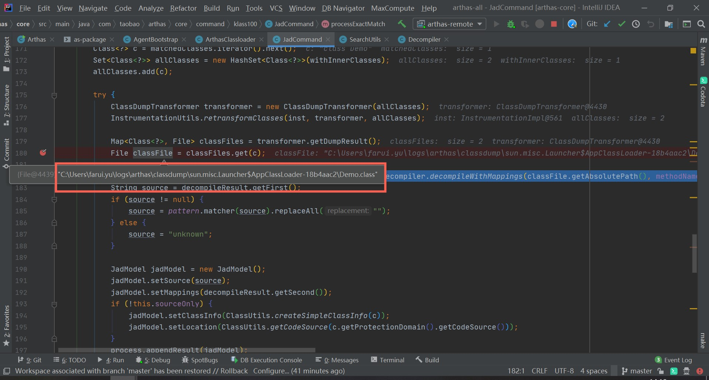

= arthas 关于编译失败的问题分析
:doctype: article
:encoding: utf-8
:lang: zh-cn
:toc: left
:toc-title: 导航目录
:toclevels: 4
:sectnums:
:sectanchors:

:hardbreaks:
:experimental:
:icons: font

pass:[<link rel="stylesheet" href="https://cdnjs.cloudflare.com/ajax/libs/font-awesome/4.7.0/css/font-awesome.min.css">]

= jad -c 编译失败

问题描述::
通过 jad -c <class> 命令,虽然打印了classLoader和Location信息,但源码为null

=== JadCommand

我们打开源码观察下JadCommand

====
[source,java]
----

    @Override
    public void process(CommandProcess process) {
    
        if (code == null && classLoaderClass != null) {
            ...
            List<ClassLoader> matchedClassLoaders = ClassLoaderUtils.getClassLoaderByClassName(inst, classLoaderClass);
            // 通过 classLoaderClass来明确code
            // 再通过code查询
            // matchedClassLoaders查询不到或过多都会抛出错误
            process.end(-1, "Found more...")
            process.end(-1, "no found...")
        }
        
        Set<Class<?>> matchedClasses = SearchUtils.searchClassOnly(inst, classPattern, isRegEx, code); <1>
    
        try {
            ExitStatus status = null;
            if (matchedClasses == null || matchedClasses.isEmpty()) {
                status = processNoMatch(process); <2>
            } else if (matchedClasses.size() > 1) {
                status = processMatches(process, matchedClasses);<3>
            } else { // matchedClasses size is 1
                // find inner classes.
                Set<Class<?>> withInnerClasses = SearchUtils.searchClassOnly(inst,  matchedClasses.iterator().next().getName() + "$*", false, code);
                if(withInnerClasses.isEmpty()) {
                    withInnerClasses = matchedClasses;
                }
                status = processExactMatch(process, affect, inst, matchedClasses, withInnerClasses); <4>
            }
            if (!this.sourceOnly) {
                process.appendResult(new RowAffectModel(affect));
            }
            CommandUtils.end(process, status);
        } catch (Throwable e){
            logger.error("processing error", e);
            process.end(-1, "processing error");
        }
        
    }
----
<1> 重点方法,我们通过指定的code(classLoader),查询类
<2> 没有匹配到,抛出错误 process.end(-1, "no found...")
<3> 匹配过多,抛出错误process.end(-1, "Found more...")
<4> 匹配到一个;这也是我们需要关注的,为什么会输出null;
====

=== SearchUtils.searchClassOnly

SearchUtils.searchClassOnly(inst, classPattern, isRegEx, code);
我们可以轻松看到源码的逻辑

. 先通过 className 匹配类
. 再通过code过滤

====
[source,java]
----
    // 先通过类名查找匹配的类
    public static Set<Class<?>> searchClass(Instrumentation inst, Matcher<String> classNameMatcher, int limit) {
        if (classNameMatcher == null) {
            return Collections.emptySet();
        }
        final Set<Class<?>> matches = new HashSet<Class<?>>();
        for (Class<?> clazz : inst.getAllLoadedClasses()) { <1>
            if (classNameMatcher.matching(clazz.getName())) {
                matches.add(clazz);
            }
            if (matches.size() >= limit) {
                break;
            }
        }
        return matches;
    }
----
<1> 调用native方法查找到所有加载的类
====

通过code过滤,我想这个应该很清楚的了;我们跳喽!

=== processExactMatch

processExactMatch(process, affect, inst, matchedClasses, withInnerClasses)

加载到唯一的类了,这样我们才会输出类相关信息

====
[source,java]
----
    private ExitStatus processExactMatch(CommandProcess process, RowAffect affect, Instrumentation inst, Set<Class<?>> matchedClasses, Set<Class<?>> withInnerClasses) {
        Class<?> c = matchedClasses.iterator().next(); <1>
        Set<Class<?>> allClasses = new HashSet<Class<?>>(withInnerClasses);
        allClasses.add(c);

        try {
            // 通过Instrumentation查找到classFile
            ClassDumpTransformer transformer = new ClassDumpTransformer(allClasses);<2>
            InstrumentationUtils.retransformClasses(inst, transformer, allClasses);

            Map<Class<?>, File> classFiles = transformer.getDumpResult();
            File classFile = classFiles.get(c);

            // 编译classFile
            Pair<String,NavigableMap<Integer,Integer>> decompileResult = Decompiler.decompileWithMappings(classFile.getAbsolutePath(), methodName, hideUnicode, lineNumber);<3>
            
            String source = decompileResult.getFirst();
            if (source != null) {
                source = pattern.matcher(source).replaceAll("");
            } else {
                source = "unknown";
            }

            JadModel jadModel = new JadModel();
            jadModel.setSource(source);
            jadModel.setMappings(decompileResult.getSecond());
            if (!this.sourceOnly) {
                jadModel.setClassInfo(ClassUtils.createSimpleClassInfo(c)); <4>
                jadModel.setLocation(ClassUtils.getCodeSource(c.getProtectionDomain().getCodeSource())); <4>
            }
            process.appendResult(jadModel);

            affect.rCnt(classFiles.keySet().size());
            return ExitStatus.success();
        } catch (Throwable t) {
            logger.error("jad: fail to decompile class: " + c.getName(), t);
            return ExitStatus.failure(-1, "jad: fail to decompile class: " + c.getName());
        }
    }

----
<1> 由上文可知匹配到的类只有一个
<2> 通过Instrument查找到classFile
<3> decompileWithMappings,编译此classFile;
<4> 打印 classLoader和location信息

====

[TIP]
====
classLoader和location信息 被打印出来了,说明没有出现,class信息也确实存在;
所以我们需要分析下classFile;
====

=== arthas-本地debug步骤

我们需要在本地debug下,观察下classFile;

参考issues
https://github.com/alibaba/arthas/issues/222[]

. 确保本地已下载arthas-all,切换到项目目录,执行./as-package.sh
. 启动Demo java -Xdebug -Xrunjdwp:transport=dt_socket,server=y,address=8000 Demo
. 在Idea中设置连接;-agentlib:jdwp=transport=dt_socket,server=y,suspend=n,address=8000
. 设置合适的断点,并debug启动
. 执行 as.sh 并attach 到Demo项目
. window环境下,arthas推荐打开 http://127.0.0.1:8563/
. 执行 jad Demo;将会进入断点

classFile名称为logs\arthas\classdump\sun.misc.Launcher$AppClassLoader-18b4aac2\Demo.class

== 结论

我们可以在对应目录`logs\arthas\classdump`查看对应的类加载文件

判断下当前class文件;

