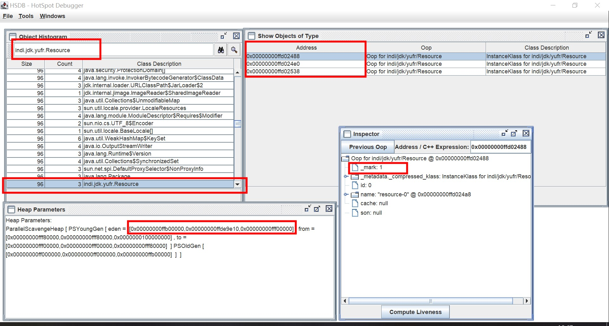

= 观察jvm内存
:doctype: article
:encoding: utf-8
:lang: zh-cn
:toc: left
:toc-title: 导航目录
:toclevels: 4
:sectnums:
:sectanchors:

:hardbreaks:
:experimental:
:icons: font

pass:[<link rel="stylesheet" href="https://cdnjs.cloudflare.com/ajax/libs/font-awesome/4.7.0/css/font-awesome.min.css">]

== 使用hsdb观察对象
jhsdb::
attach to a Java process or launch a postmortem debugger to analyze the content of a core dump from a crashed Java Virtual Machine (JVM)

官方文档-jhsdb-观察对象::
https://docs.oracle.com/en/java/javase/15/docs/specs/man/jhsdb.html[]

参考阅读-hsdb-clhsdb的使用::
https://blog.csdn.net/x_iya/article/details/81260154[]
https://blog.csdn.net/qq_31865983/article/details/98480703[]

link:..\src\main\java\indi\jdk\yufr\tool\InspectVM.java[代码描述-InspectVM.java,window=_blank]

[source]
----
# 本文环境:使用jdk-15,hsdb观察数据地址
vm-options: -Xms15m -Xmx15m -XX:+UseParallelGC -verbose:gc -showversion

# 通过命令启动hsdb
jhsdb hsdb --pid $pid
----

'''

结论::
静态变量,常量是在eden中创建的对象