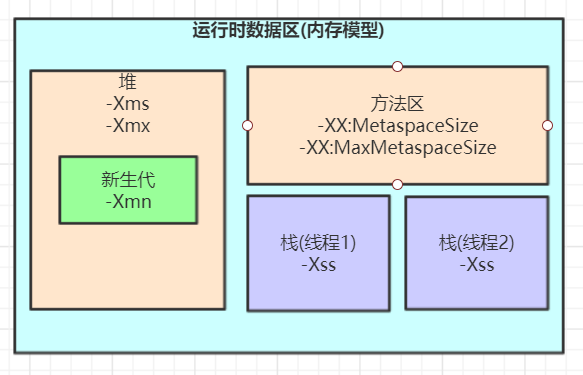
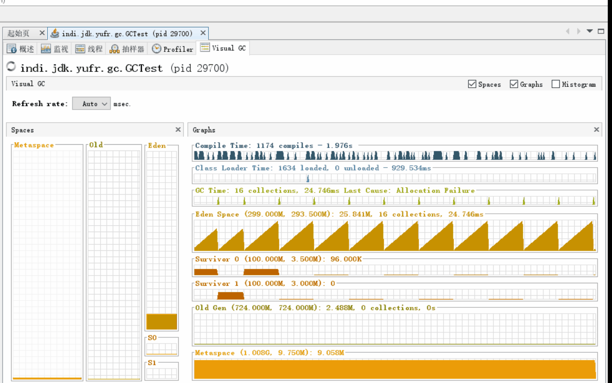
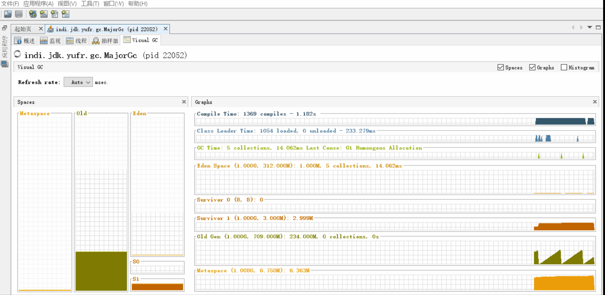

= jvm的内存模型
:doctype: article
:encoding: utf-8
:lang: zh-cn
:toc: left
:toc-title: 导航目录
:toclevels: 4
:sectnums:
:sectanchors:

:hardbreaks:
:experimental:
:icons: font

pass:[<link rel="stylesheet" href="https://cdnjs.cloudflare.com/ajax/libs/font-awesome/4.7.0/css/font-awesome.min.css">]

== jvm整体结构和内存模型

推荐阅读-jvm整体理解::
https://www.zybuluo.com/adamhand/note/1304953[]

.jvm整体结构和内存模型
image::03-image/03-jvm-memory-molde.png[800,600]

== jvm内存参数设置

参考阅读::
https://cloud.tencent.com/developer/article/1406848[]

.jvm内存参数

'''

[source]
----
# java 命令参数设置
java -Xms2048m -Xmx2048m -Xmn1024m -Xss512k -XX:MetaspaceSize=256m -XX:MaxMetaspaceSize=256m ‐jar xxx.jar

# docker-compose设置options
version: '3.4'
services:
  ${java-service-name}:
    container_name: ${container-name}
    image: java:8-jre
    environment:
      - _JAVA_OPTIONS=-Xms2048m -Xmx2048m -Xmn1024m -Xss512k -XX:MetaspaceSize=256m -XX:MaxMetaspaceSize=256m
----
== gc

=== can not escape(无法逃逸)

代码详见仓库

=== minor-gc (young gc)

'''

.verbose:gc 描述
====
[source]
----
[GC (Allocation Failure) 298337K->2660K(1045504K), 0.0010237 secs]
----
<1> Allocation Failure 触发gc原因
<2> 298337K->2660K(1045504K) 
gc前年轻代大小->gc后年轻代大小(堆总的大小)
====

=== 对象进入老年代的契机
详看 02-对象的创建与内存分配中 分配内存过程图

- 大对象
- 存活年龄过长
-XX:MaxTenuringThreshold::
对象在年轻代-最大任期阈值
Sets the maximum tenuring threshold for use in adaptive GC sizing. The largest value is 15. The default value is 15 for the parallel (throughput) collector.
- 动态年龄判断
-XX:TargetSurvivorRatio::
young-gc之后,Survivor区域需要的百分比空间
Sets the desired percentage of survivor space (0 to 100) used after young garbage collection. By default, this option is set to 50%.

=== major-gc (full-gc)
场景:大对象直接进入到老年代导致full-gc

.verbose:gc 描述
====
[source]
----
[93.155s][info][gc] GC(6) Pause Young (Concurrent Start) (G1 Humongous Allocation) 466M->2M(1024M) 3.589ms
[93.155s][info][gc] GC(7) Concurrent Cycle
[93.158s][info][gc] GC(7) Pause Remark 4M->4M(1024M) 0.942ms
[93.159s][info][gc] GC(7) Pause Cleanup 4M->4M(1024M) 0.141ms
[93.160s][info][gc] GC(7) Concurrent Cycle 4.658ms
----
====

=== 担保机制

参考阅读-担保机制::
https://www.cnblogs.com/july-sunny/p/12618054.html[]

在发生Minor GC之前，虚拟机会检查老年代最大可用的连续空间是否大于新生代所有对象的总空间，
如果大于，则此次Minor GC是安全的
如果小于，担保机制,会提前触发一次full-gc

=== gc的时机

Minor GC::
其触发条件非常简单，当 Eden 空间满时，就将触发一次Minor GC

Full GC::
- 手动触发System.gc()
- 老年代空间不足
- 担保失败
- 执行 CMS GC 的过程中同时有对象要放入老年代

=== gc-root

=== sof and oom