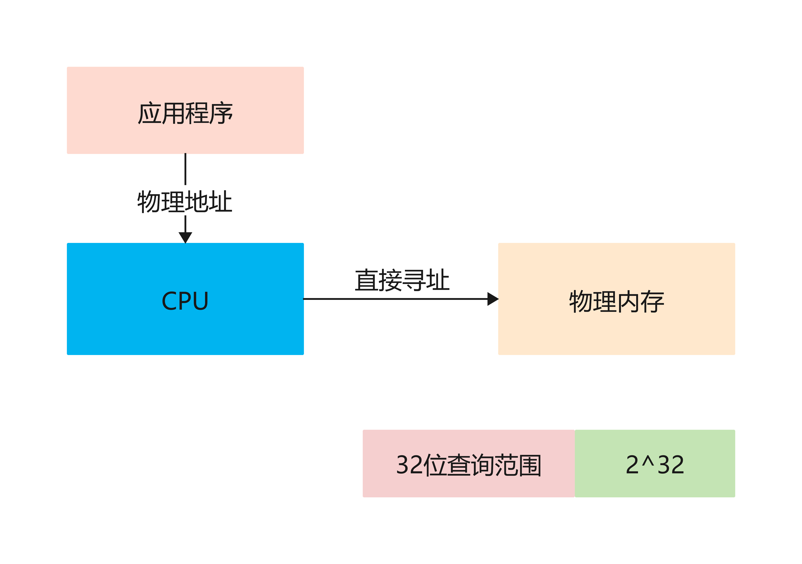
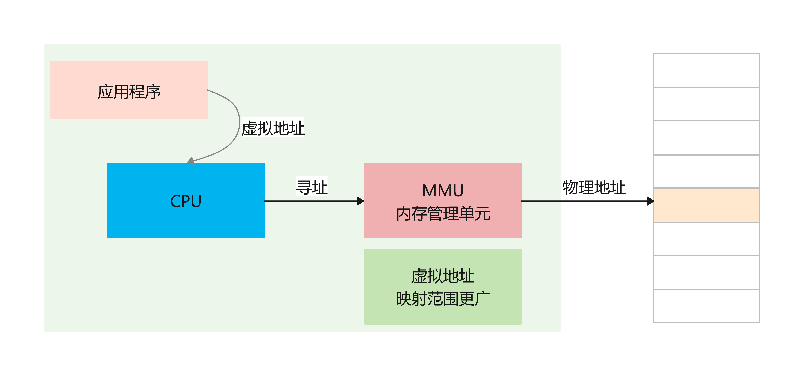
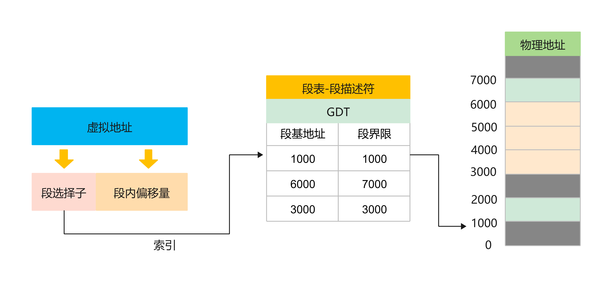
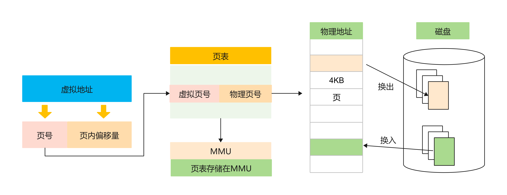
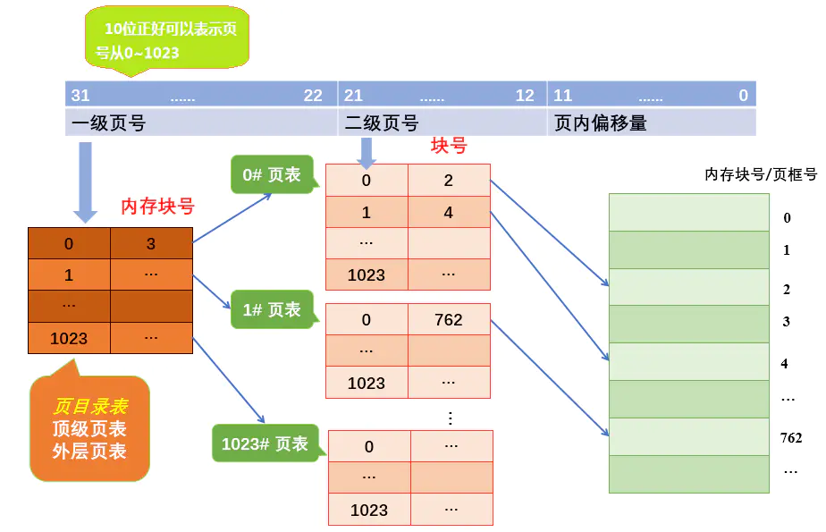
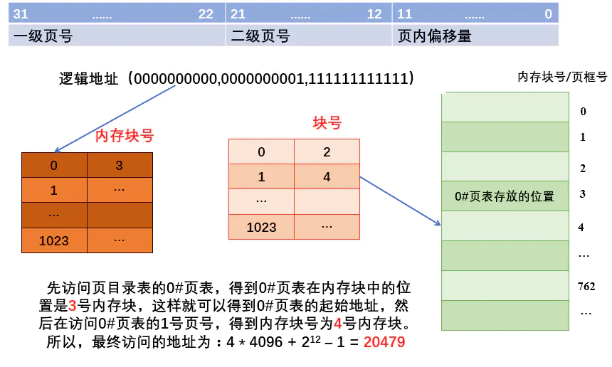
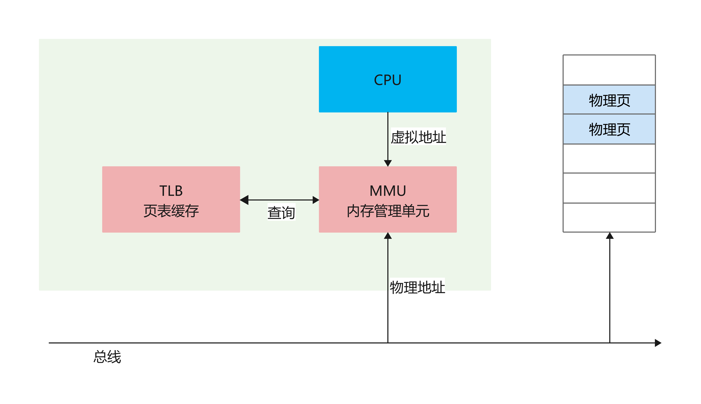
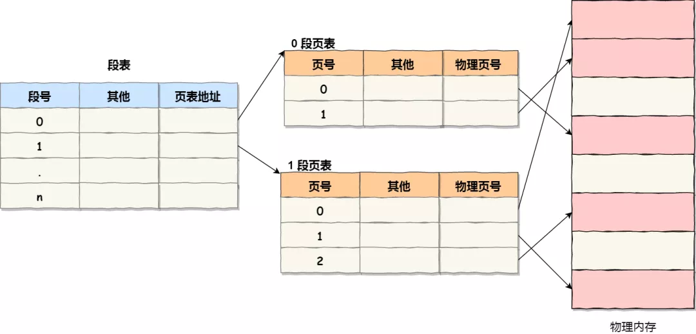
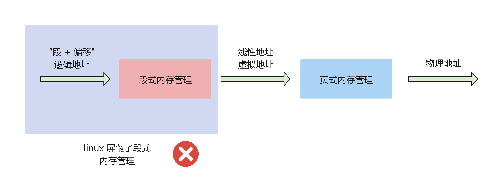
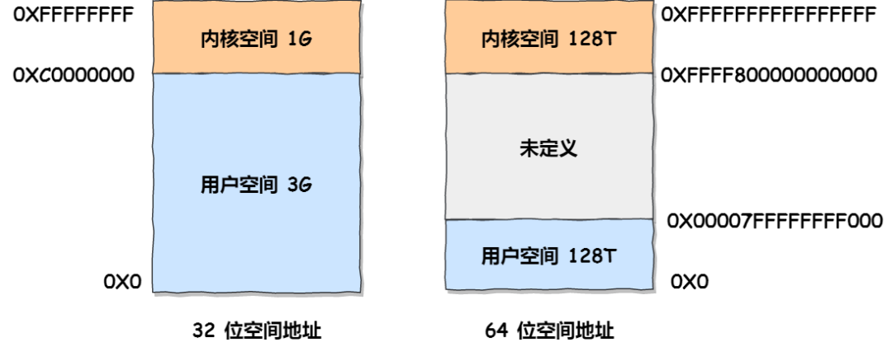

= 操作系统-内存管理
:doctype: book
:encoding: utf-8
:lang: zh-cn
:toc: left
:toc-title: 导航目录
:toclevels: 4
:sectnums:
:sectanchors:

:hardbreaks:
:experimental:
:icons: font

pass:[<link rel="stylesheet" href="https://cdnjs.cloudflare.com/ajax/libs/font-awesome/4.7.0/css/font-awesome.min.css">]

推荐阅读-内存管理::
https://mp.weixin.qq.com/s?__biz=MzUxODAzNDg4NQ==&mid=2247485033&idx=1&sn=bf9ba7aca126ad186922c57a96928593&chksm=f98e42c3cef9cbd514df38d04deb5e7a9ea67dbd478da75fc4a7636ee90b1384d65f68eb23f5&cur_album_id=1408057986861416450&scene=190#rd[小林coding-图解操作系统-内存管理]

== 虚拟内存地址

在32位操作系统中,数据的寻址,是通过32-byte来确认的;按照32-byte数据,通过直接映射可寻找
2^32 byte = 2^10 2^10 2^10 2^2 byte= 4g;
由此可知,直接映射寻址,寻找到的数据限制为4g,若内存超过4g;则无法寻址;故而引入了虚拟内存地址;

.virtual_memory_address_01

.virtual_memory_address_02

== 内存分段

推荐阅读-分段与分页::
https://segmentfault.com/a/1190000038810428[]

段寄存器的出现于 https://zh.wikipedia.org/wiki/Intel_8086[intel_8086处理器];

首个32位系统 https://zh.wikipedia.org/wiki/Intel_80386[intel_80386处理器]

.memory_segment

内存分段会出现

- 内存碎片问题
- 内存交换的效率低问题

== 内存分页

分页是把整个虚拟和物理内存空间切成一段段固定尺寸的大小。这样一个连续并且尺寸固定的内存空间，我们叫页（Page）。在 Linux 下，每一页的大小为 4KB。

.memory_single_page

假设4G内存,一页4KB;
总共需要 4G/4KB = 2^32 byte / 2^12 byte = 2^20 个页;
假定页表中,每个页表项 4 byte
则单级分页中,一个页表大小为 4 byte * 2^20=4MB
而页表是属于进程的;若有100个进程;则需要的页表占用的内存过大;cpu中是无法装下这么大内存的;

== 多级页表

推荐阅读-两级页表::
https://www.jianshu.com/p/51c2286a6268[]

.memory_double_page

.memory_double_page_address

[TIP]
====
分了二级表，映射 4GB 地址空间就需要 4KB（一级页表）+ 4MB（二级页表）的内存，这样占用空间不是更大了吗？
====

由计算机组成原理里面无处不在的局部性原理;
如果某个一级页表的页表项没有被用到，也就不需要创建这个页表项对应的二级页表了，即可以在需要时才创建二级页表。做个简单的计算，假设只有 20% 内存被程序使用到，那么页表占用的内存空间就只有 4KB（一级页表） + 20% * 4MB（二级页表）= 0.804MB
，这对比单级页表的 4MB 是不是一个巨大的节约？

而对于 64 位的系统，两级分页肯定不够了，就变成了四级目录;

== TLB

多级页表虽然解决了空间上的问题，但是虚拟地址到物理地址的转换就多了几道转换的工序，这显然就降低了这俩地址转换的速度，也就是带来了时间上的开销。

因此我们可以为多级页表增加缓存;

== 段页式内存管理

段页式内存管理实现的方式：

- 先将程序划分为多个有逻辑意义的段，也就是前面提到的分段机制；
- 接着再把每个段划分为多个页，也就是对分段划分出来的连续空间，再划分固定大小的页；

== linux 中的内存管理

.linux的内存管理方式

.linux内存分布
