= 操作系统-cpu
:doctype: book
:encoding: utf-8
:lang: zh-cn
:toc: left
:toc-title: 导航目录
:toclevels: 4
:sectnums:
:sectanchors:

:hardbreaks:
:experimental:
:icons: font

pass:[<link rel="stylesheet" href="https://cdnjs.cloudflare.com/ajax/libs/font-awesome/4.7.0/css/font-awesome.min.css">]

== cpu指令

推荐阅读-CPU-执行程序的过程::
https://mp.weixin.qq.com/s?__biz=MzUxODAzNDg4NQ==&mid=2247485918&idx=1&sn=f7fa3aa2a7cc362eeebad09d4d6fa03a&chksm=f98e4d74cef9c46201a669fba2d111ea1d4f4c465b37d361034308ac42822d6f003fe059322c&cur_album_id=1408057986861416450&scene=190#rd[小林coding-图解操作系统-CPU执行程序的过程]

=== 程序执行的基本过程

参考阅读-寄存器-wiki::
https://zh.wikipedia.org/wiki/%E5%AF%84%E5%AD%98%E5%99%A8[寄存器-wiki]

.cpu处理程序的基本过程
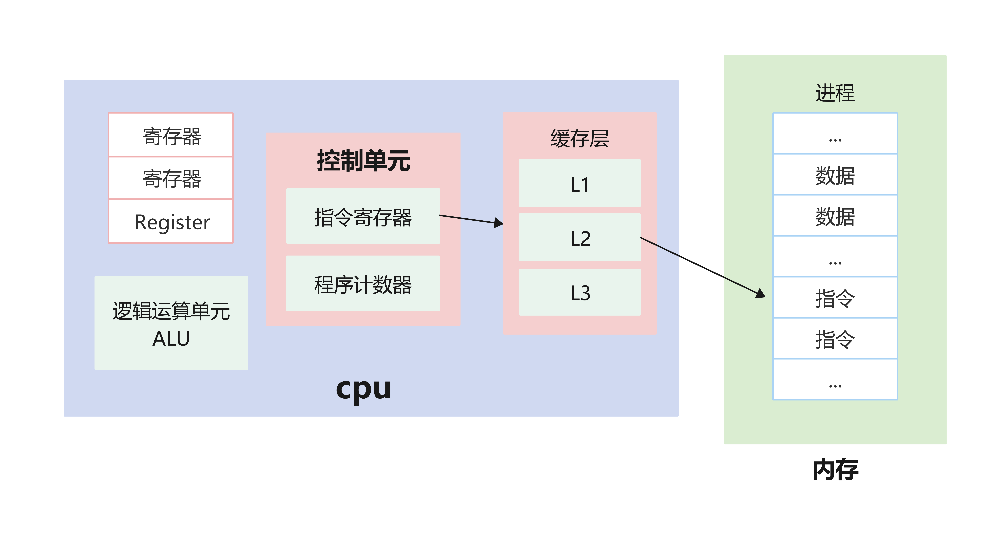

=== 数据与指令

注意，数据和指令是分开区域存放的，存放指令区域的地方称为「正文段」.

Java编译器指令流基于栈的指令集架构;
由于跨平台性的设计,Java的指令都是根据栈来设计的;
大部分情况下，寄存器的架构，一，二，三地址指令为主，而基于栈的指令集却是以零地址指令为主。零地址指令只有操作码,没有操作数;
如指令 iadd,是没有任何参数的;

[source]
----
  //反汇编的指令集
  public int add();
    Code:
       0: iconst_2
       1: istore_1
       2: iconst_3
       3: istore_2
       4: iload_1
       5: iload_2
       6: iadd
       7: ireturn
----

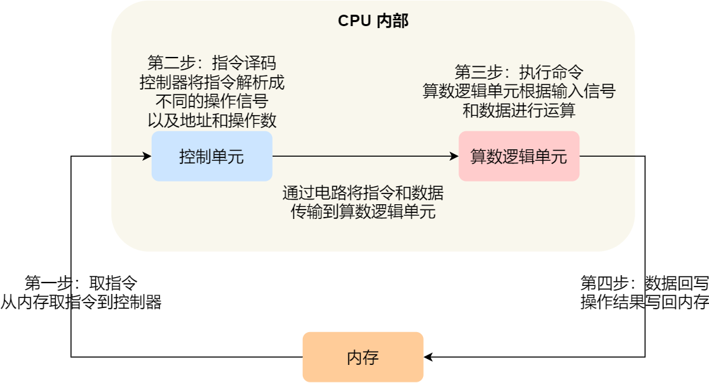

=== 指令的运行速度

1GHz表示1秒产生1G次脉冲信号;
而一次脉冲信号高低电平的转换就是一个时钟周期;

1G = 10^9 Hz;

对于 CPU 来说，在一个时钟周期内，CPU 仅能完成一个最基本的动作，时钟频率越高，时钟周期就越短，工作速度也就越快。

大多数指令通常需要若干个时钟周期。不同的指令需要的时钟周期是不同的，如乘法需要的时钟周期就要比加法多;

== cpu-cache

推荐阅读-cpu缓存::
https://mp.weixin.qq.com/s?__biz=MzUxODAzNDg4NQ==&mid=2247485960&idx=1&sn=476d40b3e272149ba6c7370340e9768f&chksm=f98e4ea2cef9c7b40cc250d22f2fa92f8fd6ced6f658afd321714932c999c2421f5f566e6a09&cur_album_id=1408057986861416450&scene=190#rd[小林coding-图解操作系统-CPU缓存]

CPU Cache 的结构::
CPU Cache 是由很多个 Cache Line 组成的，CPU Line 是 CPU 从内存读取数据的基本单位，而 CPU Line 是由各种标志（Tag）+ 数据块（Data Block）组成;

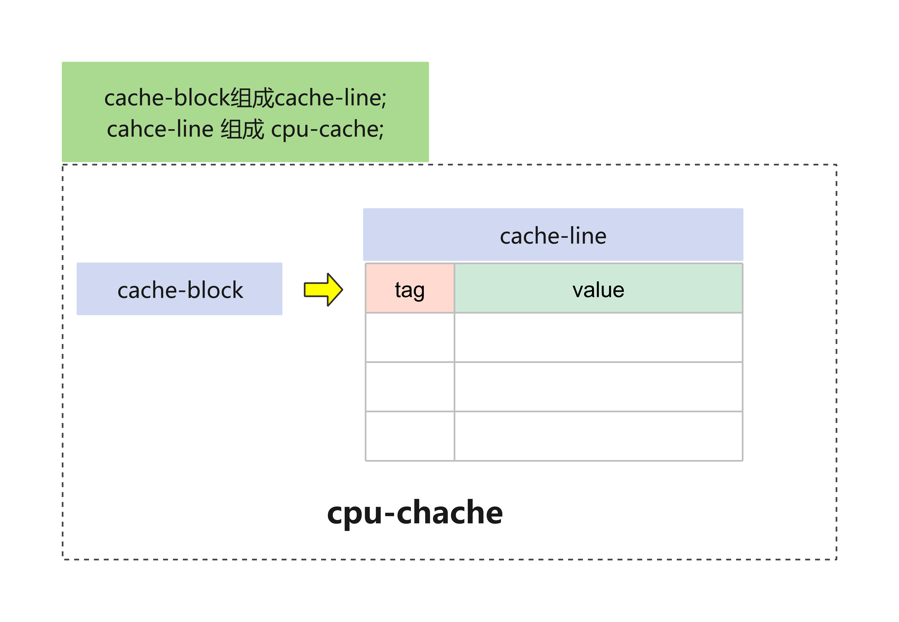

.缓存层次-1
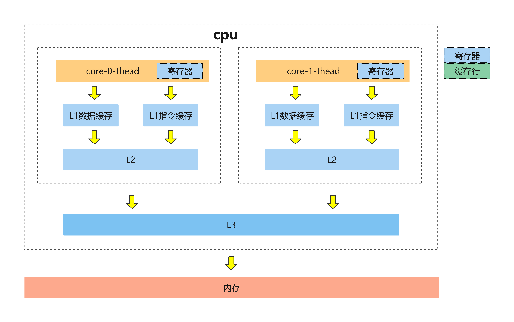

.缓存层次-2
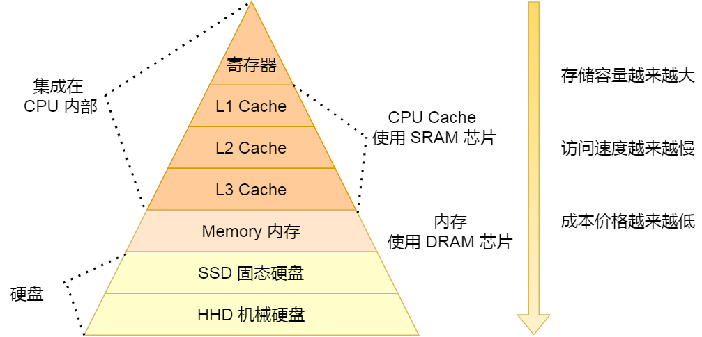

[width="100%"]
|====================
|  类别| 大小|运行的时钟周期
|  寄存器|  64byte|1cycle
|  L1|  32KB*2|3~4cycle
|  L2|  256KB|10~20cycle
|  L3|  4MB|20~60cycle
|内存|  以G为单位|200~300cycle
|====================

=== 查看系统参数

推荐阅读-查看linux系统参数::
https://www.cnblogs.com/ggjucheng/archive/2013/01/14/2859613.html[]

[source]
----
lscpu

# 
Architecture:          x86_64
CPU op-mode(s):        32-bit, 64-bit
Byte Order:            Little Endian
CPU(s):                2
On-line CPU(s) list:   0,1
Thread(s) per core:    1
Core(s) per socket:    1
Socket(s):             2
NUMA node(s):          1
Vendor ID:             GenuineIntel
CPU family:            6
Model:                 85
Model name:            Intel Xeon Processor (Skylake, IBRS)
Stepping:              4
CPU MHz:               2494.124
BogoMIPS:              4988.24
Hypervisor vendor:     KVM
Virtualization type:   full
L1d cache:             32K
L1i cache:             32K
L2 cache:              4096K
NUMA node0 CPU(s):     0,1
----

=== CPU为何要有高速缓存

CPU在摩尔定律的指导下以每18个月翻一番的速度在发展，然而内存和硬盘的发展速度远远不及CPU。这就造成了高性能能的内存和硬盘价格及其昂贵。然而CPU的高度运算需要高速的数据。为了解决这个问题，CPU厂商在CPU中内置了少量的高速缓存以解决I\O速度和CPU运算速度之间的不匹配问题。

在CPU访问存储设备时，无论是存取数据抑或存取指令，都趋于聚集在一片连续的区域中，这就被称为局 部性原理。 

- 时间局部性（Temporal Locality）：如果一个信息项正在被访问，那么在近期它很可能还会被再次访问。 比如循环、递归、方法的反复调用等。
- 空间局部性（Spatial Locality）：如果一个存储器的位置被引用，那么将来他附近的位置也会被引用。 比如顺序执行的代码、连续创建的两个对象、数组等。

== cpu的缓存一致性

推荐阅读-cpu的缓存一致性::
https://mp.weixin.qq.com/s?__biz=MzUxODAzNDg4NQ==&mid=2247486479&idx=1&sn=433a551c37a445d068ffbf8ac85f0346&chksm=f98e48a5cef9c1b3fadb691fee5ebe99eb29d83fd448595239ac8a2f755fa75cacaf8e4e8576&cur_album_id=1408057986861416450&scene=190#rd[小林coding-图解操作系统-缓存一致性]

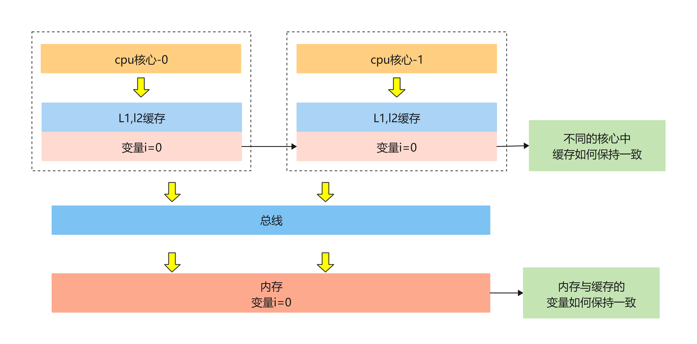

=== cache中的数据如何与内存一致

- 写直达(write through)
把数据同时写入内存和 Cache 中
- 写回(write back)
当发生写操作时，新的数据仅仅被写入 Cache-Block 里，只有当修改过(变脏)的 Cache-Block「被替换」时才需要写到内存中

推荐阅读-Caches (Writing)::
http://www.cs.cornell.edu/courses/cs3410/2013sp/lecture/18-caches3-w.pdf[]

推荐阅读-write-through and write-back::
https://www.geeksforgeeks.org/write-through-and-write-back-in-cache/?ref=rp[write-through and write-back]

参考阅读-wiki-cache::
https://en.wikipedia.org/wiki/Cache_(computing)[]

.write-back
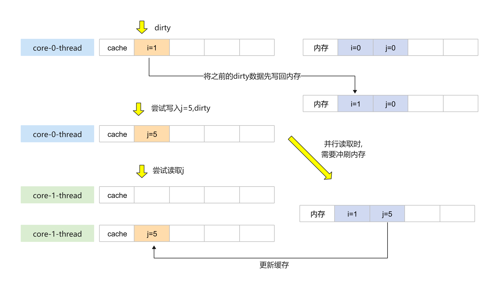

.Write-Allocate
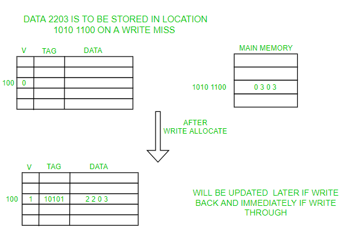

.No-Write-Allocate
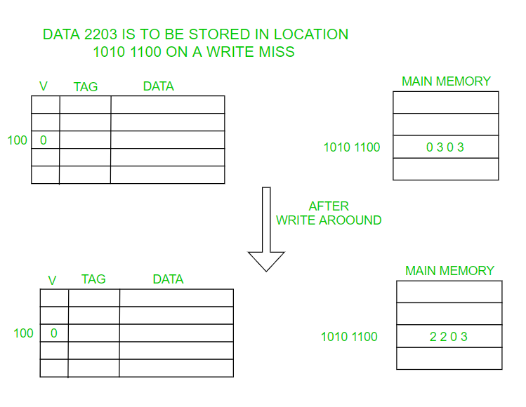

=== cpu核心间如何保持一致性

. 某个 CPU 核心里的 Cache 数据更新时，必须要传播到其他核心的 Cache，这个称为写传播（Wreite Propagation）；

. 某个 CPU 核心里对数据的操作顺序，必须在其他核心看起来顺序是一样的，这个称为事务的串形化（Transaction Serialization）。

=== 基于总线嗅探的MESI协议

推荐阅读-mesi协议::
https://blog.csdn.net/muxiqingyang/article/details/6615199[]

- Modified，已修改
- Exclusive，独占
- Shared，共享
- Invalidated，已失效

整个 MESI 的状态可以用一个有限状态机来表示Cache-Line的状态流转。对于不同状态触发的事件操作，可能是来自本地CPU核心发出的广播事件，也可以是来自其他 CPU核心通过总线发出的广播事件

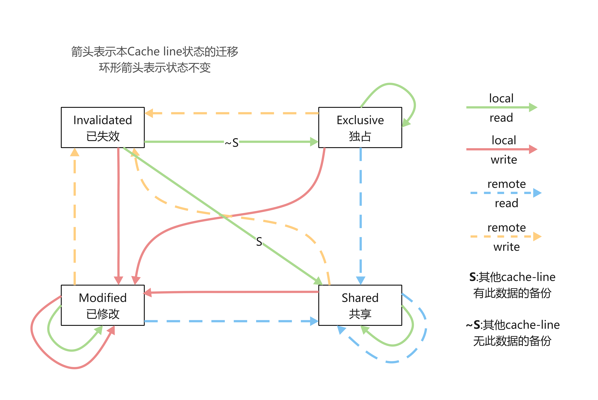

=== cpu-false-sharing

伪共享,cpu同一条cache-line上共存两个共享变量,通过cpu-mesi协议,其状态的流转,一起变换;造成频繁的读取内存,进而导致缓存失效;

注意:已失效状态要重新获取对象,则需要,从内存中重新获取;

.false-sharing
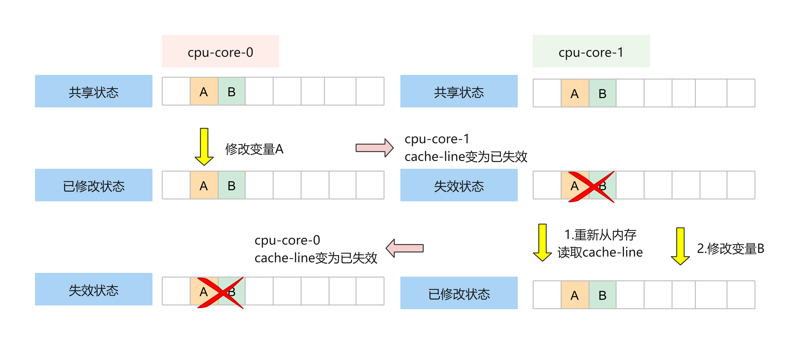

== 使cpu运行速度更快

- 分支预测

对于 if 条件语句，意味着此时至少可以选择跳转到两段不同的指令执行，也就是 if 还是 else 中的指令。那么，如果分支预测可以预测到接下来要执行 if 里的指令，还是 else 指令的话，就可以「提前」把这些指令放在指令缓存中，这样 CPU 可以直接从 Cache 读取到指令，于是执行速度就会很快。

https://stackoverflow.com/questions/11227809/why-is-processing-a-sorted-array-faster-than-processing-an-unsorted-array[stackoverflow-branch-prediction]