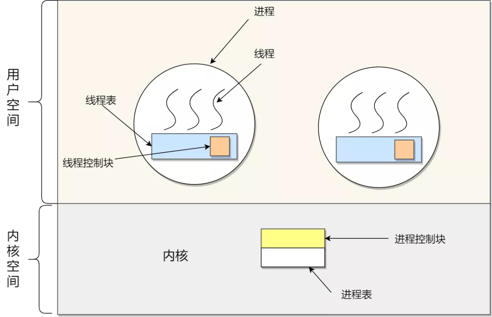

= 操作系统-进程和线程
:doctype: book
:encoding: utf-8
:lang: zh-cn
:toc: left
:toc-title: 导航目录
:toclevels: 4
:sectnums:
:sectanchors:

:hardbreaks:
:experimental:
:icons: font

pass:[<link rel="stylesheet" href="https://cdnjs.cloudflare.com/ajax/libs/font-awesome/4.7.0/css/font-awesome.min.css">]

此篇文章不讨论进程模型;以快速过渡到java的线程为目标;

== 线程模型

线程与进程最大的区别在于：线程是调度的基本单位，而进程则是资源拥有的基本单位。

.ult-User-Level-Thread

.klt-Kernel-Level-Thread
image::image/03_thread_klt.png[800,600]

java使用的是内核线程模型;

推荐阅读-java的线程模型::
https://mp.weixin.qq.com/s/XZV6FGqT-E_zNOl-sRDe-w[]

在JVM中除了应用线程，还有其他的一些线程用于支持JVM的运行，这些线程可以被划分为以下几类：

- VM Thread
负责JVM在安全点内的各种操作，这些操作（诸如自动内存管理、取消偏向锁、线程dump、线程挂起等等）在执行过程中需要JVM处于这样一个状态——堆的内容不会被改变，这种状态在JVM里叫做安全点（safe-point）。

- Periodic task thread
这个线程负责响应定时触发的事件（例如：中断），用来执行一些定时操作。

- GC thread
这些线程负责JVM里的垃圾收集活动；

- Compiler threads
这些线程负责在运行时将字节码编译为本地代码；

- Singal dispatcher thread
这些线程负责响应外部发给当前JVM进程的信号，并通过调用JVM内的其他线程。