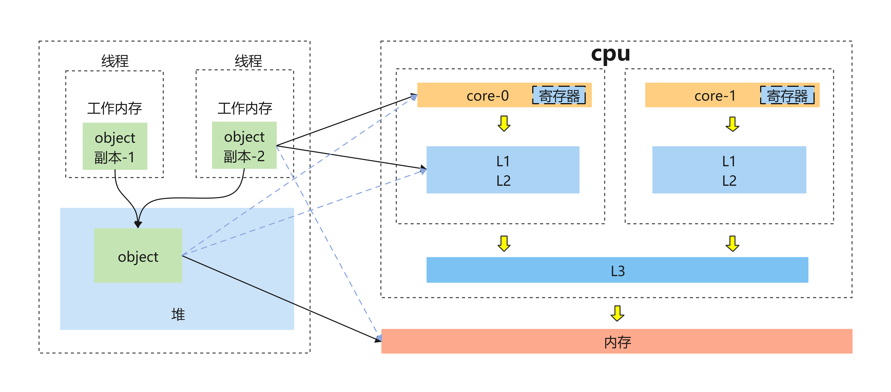
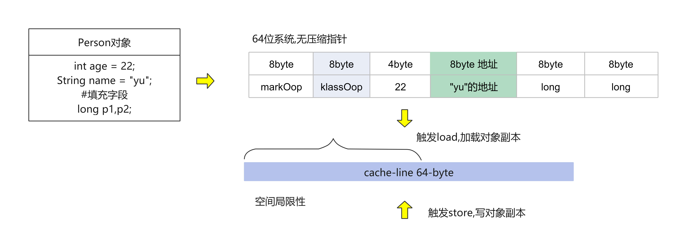
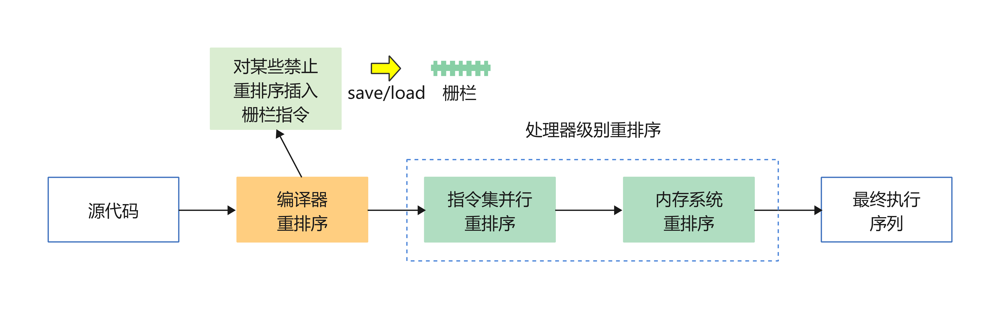
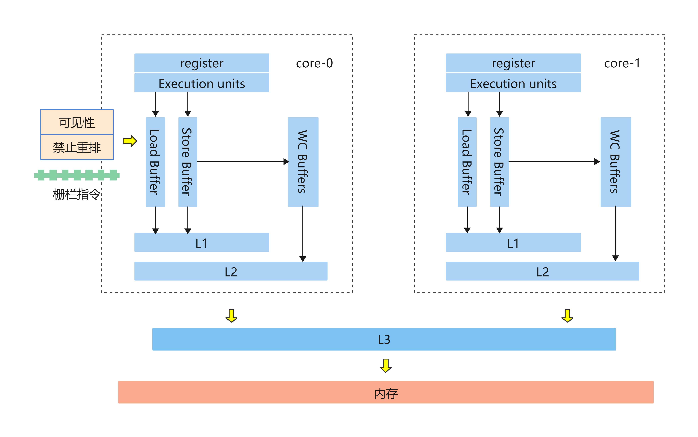
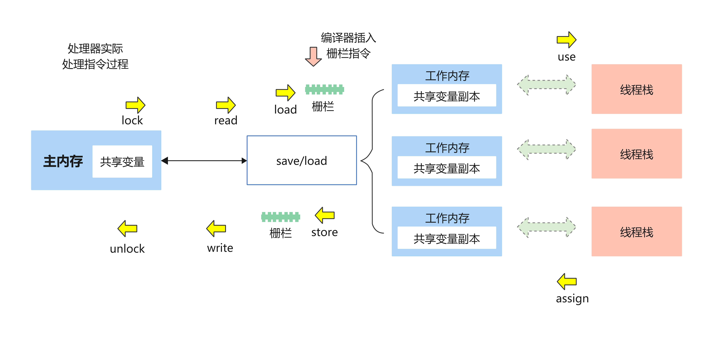
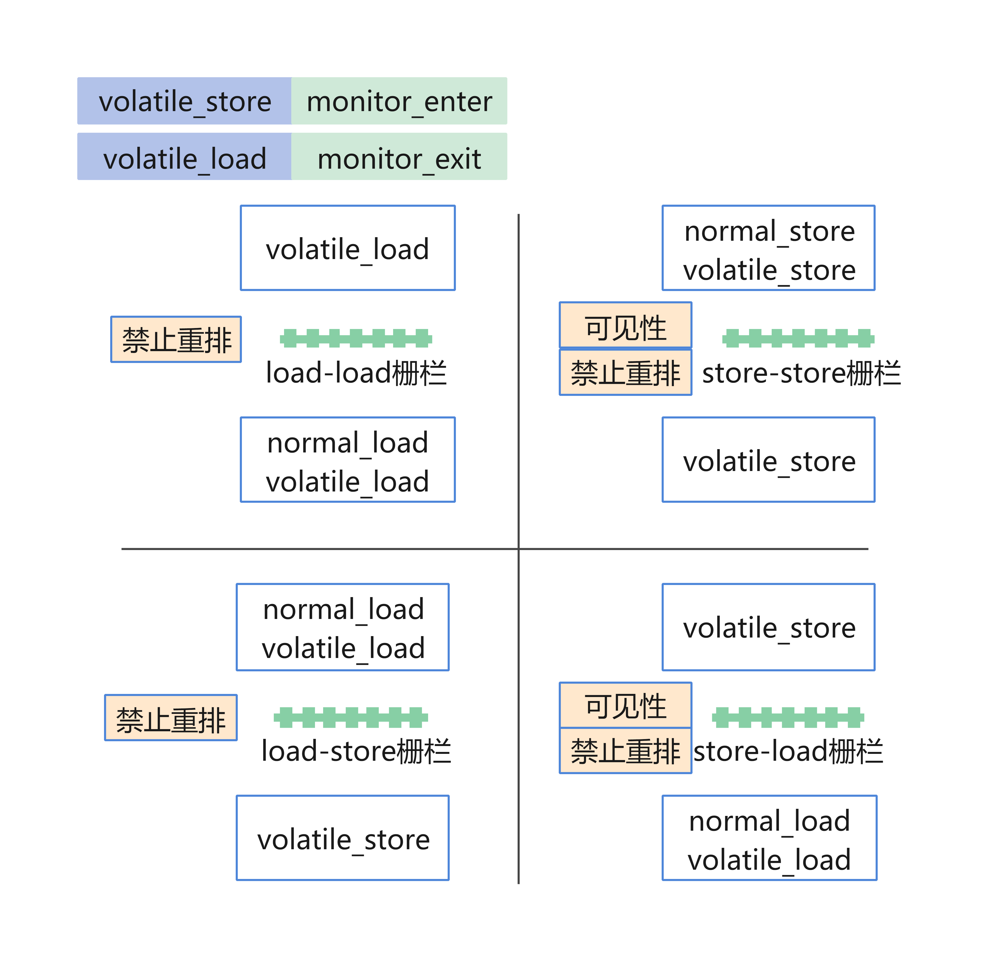

= java-内存模型
:doctype: book
:encoding: utf-8
:lang: zh-cn
:toc: left
:toc-title: 导航目录
:toclevels: 4
:sectnums:
:sectanchors:

:hardbreaks:
:experimental:
:icons: font

pass:[<link rel="stylesheet" href="https://cdnjs.cloudflare.com/ajax/libs/font-awesome/4.7.0/css/font-awesome.min.css">]

推荐阅读-java-memory-model::
http://www.cs.umd.edu/~pugh/java/memoryModel/

== Java内存模型

.jmm_base

.object_model

推荐阅读-jmm-cookbook::
http://gee.cs.oswego.edu/dl/jmm/cookbook.html

推荐阅读-jmm-中文版::
http://ifeve.com/jmm-cookbook/

=== data-dependency-数据依赖性

如果两个操作访问同一个变量，且这两个操作中有一个为写操作，此时这两个操作之间就存在数据依赖性;

.数据依赖
[width="60%"]
|====================
|名称	|代码示例	|说明
|写后读	|a = 1;b = a;	|写一个变量之后，再读这个位置。
|写后写	|a = 1;a = 2;	|写一个变量之后，再写这个变量。
|读后写	|a = b;b = 1;	|读一个变量之后，再写这个变量。
|====================

上面三种情况，只要重排序两个操作的执行顺序，程序的执行结果将会被改变。

=== as-if-serial语义
as-if-serial语义的意思指：不管怎么重排序（编译器和处理器为了提高并行度），（单线程）程序的执行结果不能被改变。编译器，runtime 和处理器都必须遵守as-if-serial语义。

要遵守as-if-serial,则存在数据依赖的代码,不能改变执行顺序;

=== reOrder-重排序
在遵守as-if-serial之后,没有数据依赖的代码还是可能执行重排序;

link:..\src\main\java\indi\concurrency\yufr\jmm\ReOrderTest.java[代码描述-ReOrderTest.java,window=_blank]

参考阅读-内存模型-reorder::
http://ifeve.com/java-memory-model-1/

- 处理器级别的指令重排

推荐阅读-x86-指令重排序::
https://stackoverflow.com/questions/50307693/does-an-x86-cpu-reorder-instructions[]

.常见处理器允许的重排序类型
[width="60%"]
|====================
|允许重排?|Load-Load	|Load-Store	|Store-Store	|Store-Load	|数据依赖
|sparc-TSO	|N	|N	|N	|Y	|N
|x86	|N	|N	|N	|Y	|N
|ia64	|Y	|Y	|Y	|Y	|N
|PowerPC	|Y	|Y	|Y	|Y	|N
|====================

- reorder for compile and runtime 

.jmm指令重排
[width="60%"]
|====================
|能否重排?	3+|第二个操作
|第一个操作	|Normal Load
Normal Store	|Volatile load
MonitorEnter	|Volatile store
MonitorExit

|Normal Load
Normal Store	|  |  |No

|Volatile load
MonitorEnter	|No|No|No

|Volatile store
MonitorExit	|  |No|No
|====================

==== final
对于final字段,下面代码无法重排序
[source]
====
objectX.finalField = v;
...
sharedRef = objectX;
====

=== Memory-Barriers-内存屏障

推荐阅读-memory-barriers::
https://mechanical-sympathy.blogspot.com/2011/07/memory-barriersfences.html[]

几乎所有的处理器至少支持一种粗粒度的屏障指令，通常被称为“栅栏（Fence）”，它保证在栅栏前初始化的load和store指令，能够严格有序的在栅栏后的load和store指令之前执行;

.atomic-operation

代码顺序并不是真正的执行顺序，只要有空间提高性能，CPU和编译器可以进行各种优化。缓存和主存的读取会利用load, store和write-combining buffers来缓冲和重排

[width="60%"]
|====================
|需要的屏障	4+|第二步
|第一步	|Normal Load	|Normal Store|Volatile Load MonitorEnter	|Volatile Store MonitorExit
|Normal Load	|	|	|	|LoadStore
|Normal Store	|	|	|	|StoreStore
|Volatile Load MonitorEnter	|LoadLoad	|LoadStore	|LoadLoad	|LoadStore
|Volatile Store MonitorExit| ||StoreLoad|StoreStore
|====================

synchronized volatile 和屏障
[source,java]
----
class X {
	int a;
	volatile int v;

	void f() {
		int i;
		synchronized (this) { // enter EnterLoad EnterStore
			i = a;// load a
			a = i;// store a
		}// LoadExit StoreExit exit ExitEnter

		synchronized (this) {// enter ExitEnter
			synchronized (this) {// enter
			}// EnterExit exit
		}// ExitExit exit ExitEnter ExitLoad

		i = v;// load v

		synchronized (this) {// LoadEnter enter
		} // exit ExitEnter ExitStore

		v = i; // store v
		synchronized (this) { // StoreEnter enter
		} // EnterExit exit
	}

}
----

=== Removing-Barriers 屏障消除
[width="80",%autowidth,align=center]
|====================
3+|Original	|=>	3+|Transformed
|1st	|ops	|2nd	|=>	|1st	|ops|2nd
|LoadLoad	|[no loads]	|LoadLoad	|=>	
|[no loads]	|LoadLoad

|LoadLoad	|[no loads]	|StoreLoad	|=>	
|  |[no loads]	|StoreLoad

|StoreStore	|[no stores]	|StoreStore	|=>	
|  |[no stores]	|StoreStore

|StoreStore	|[no stores]	|StoreLoad	|=>	
|  |[no stores]	|StoreLoad

|StoreLoad	|[no loads]	|LoadLoad	|=>	|  |StoreLoad	|[no loads]|

|StoreLoad	|[no stores]	|StoreStore	|=>	|StoreLoad	|[no stores]|

|StoreLoad	|[no volatile loads]	|StoreLoad	|=>	|[no volatile loads]	|StoreLoad|
|====================

=== happens-before-order

推荐阅读-jmm-reorder::
http://ifeve.com/jvm-reordering/[]

单线程内程序执行顺序,与代码顺序并不一致,但是由as-if-serial,还是能帮助单线程执行顺序,不影响执行结果;

volatile-synchronized中所描述的屏障,并不一定内保证,单线程内的执行顺序严格执行;

happens-before 是用来描述可见性的一种规则;
actionA happens-before ActionB，记作hb(ActionA,ActionB) 等价于 ActionA < ActionB
简记为 hb(a,b);

[width="60%"]
|====================
|Thread1|Thread2
|x1|y1
|x2|b
|a|y2
|====================

如果 Thread1 中a操作已经在b操作之前发生,则a及之前操作都对Thread2 b及之后操作保持可见性;

推荐阅读-happens-before::
http://ifeve.com/easy-happens-before/[]

. 程序次序规则
同一线程内,若a在b之前执行,则有hb(a,b)

. 锁定规则
unLock操作 happens-before 同锁的lock操作；

. volatile变量规则
volatile-write happens-before volatile-load

. 传递规则
If hb(x, y) and hb(y, z), then hb(x, z).

. 线程启动规则
线程start()之前的共享变量,对线程可见;

. 线程中断规则
若线程捕获到中断信号，其必先执行 interrupt()方法

. 对象init-finalize规则
对象的构造方法 happens-before 对象的finalize()
link:..\src\main\java\indi\concurrency\yufr\jmm\InterruptTest.java[代码描述-InterruptTest.java,window=_blank]

. 线程终结规则
线程的所有行为都优于线程的终结(join)

